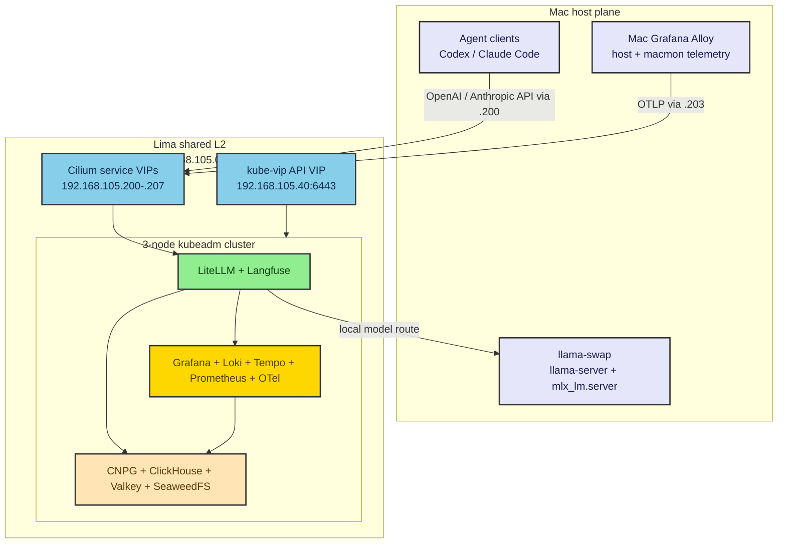

# ai-infra-platform

A personal AI infrastructure lab for macOS / Apple Silicon. It gives one
engineer a production-shaped gateway, tracing, metrics, logs, secrets workflow,
and failure-drill surface for coding agents on a single Mac.

The stack runs a **LiteLLM** gateway, **Langfuse** observability, an externalized
data plane (**CloudNativePG** Postgres, **Altinity ClickHouse**, **Valkey**,
**SeaweedFS** S3), and an **LGTM** observability stack (Grafana / Loki / Tempo /
Prometheus plus an in-cluster **OpenTelemetry Collector**) on **kubeadm**
Kubernetes (upstream k8s + **Cilium** CNI, kube-proxy-free) under **Lima**.
Host-side model serving comes from **llama-swap** fronting `llama-server` and
`mlx_lm.server`, with **macmon** host metrics. A shared `session.id` lets
sanitized agent turns be correlated across LiteLLM, Langfuse, Loki, Tempo,
Prometheus time windows, and host telemetry.

> Architecture in one line: a production-shaped local AI stack on one Mac, with
> a lean default profile, a proof-gated HA-shaped profile, and explicit claim
> boundaries — see [`docs/architecture.md`](docs/architecture.md),
> [`docs/profiles.md`](docs/profiles.md), and
> [`docs/claim-boundaries.md`](docs/claim-boundaries.md).

## Who this is for

Engineers who want a production-shaped local stack to drive coding agents
(**Codex**, **Claude Code**) against local models and subscription passthrough,
with session correlation across gateway traces, logs, metrics, and Langfuse.

## What makes it different

- Profiled topology: a lean single-node default for constrained hosts, plus a
  3-node HA-shaped profile with etcd quorum, replicated data stores, PDBs, and
  pod anti-affinity. Treat node-loss and service-failover claims as proof-gated
  by the HA smoke suite.
- Full-capture telemetry is a local-lab debugging posture with an explicit
  privacy caveat; secrets and auth headers are still never logged.
- Subscription / OAuth passthrough rather than BYOK provider keys — the client
  keeps its own credential.
- Secrets managed by **fnox + age**; no `.env` holds a sensitive value.
- Service access via **Cilium LoadBalancer VIPs** on the Lima shared L2 subnet —
  each host-facing service answers on a stable `192.168.105.x` address reachable
  directly from the Mac. `kubectl port-forward` remains as a non-HA fallback;
  run `mise run smoke:ha` before publishing specific failover claims.

## Architecture overview

The platform is organized into five planes:

- **Host plane** — host-side model serving (mise-managed **llama-swap** fronting
  the Homebrew `llama-server` and `mlx_lm.server` backends), a Mac-side
  OpenTelemetry shipper, and `macmon` host metrics.
- **Control / cluster plane** — Lima VMs running upstream **kubeadm**
  Kubernetes, a **kube-vip** control-plane VIP (`192.168.105.40`), and
  **Cilium** CNI (kube-proxy-free) + Hubble. The lean default uses one larger
  node; the HA profile uses three control-plane nodes (`ai-inf-platform-0/1/2`)
  with **stacked etcd** quorum 2/3. In both profiles, the control-plane taint is
  removed so workloads schedule on available nodes.
- **Application plane** — the LiteLLM gateway and Langfuse web + worker.
- **Data plane** — CloudNativePG Postgres, Altinity ClickHouse (+ Keeper),
  Valkey, and SeaweedFS S3, all in-cluster.
- **Observability plane** — the LGTM stack (Grafana, Loki, Tempo, Prometheus),
  the in-cluster OpenTelemetry Collector, and the Alloy self-log shipper.



The full topology, data flows, and the complete diagram set live in
[`docs/architecture.md`](docs/architecture.md).

## Design and key decisions

Each headline decision has a one-line rationale; the deeper reasoning is in the
linked docs and in the spec's Decisions Log (§19).

- **Profiled local lab** — upstream kubeadm k8s with a lean single-node default
  and a 3-node HA-shaped profile. The HA profile uses stacked-etcd quorum, a
  kube-vip control-plane VIP, Cilium service VIPs, replicas, PDBs, and
  anti-affinity; the HA smoke suite is the proof gate for node-loss claims.
- **Externalized data stores** instead of bundled subcharts — no Bitnami, direct
  or transitive. See [`docs/chart-selection.md`](docs/chart-selection.md).
- **LiteLLM via raw manifests** rather than the official chart — Bitnami
  avoidance.
- **Subscription / OAuth passthrough** for Codex and Claude Code Max — clients
  keep their provider credential and authenticate to LiteLLM via a virtual key.
- **Session-correlated telemetry** with the GenAI OTTL transform as the keystone
  and full capture documented as a local-lab-only debugging posture — see
  [`docs/observability-taxonomy.md`](docs/observability-taxonomy.md).
- **fnox + age** for secrets; **Cilium LoadBalancer VIPs** on the Lima shared L2
  for HA service access (port-forward kept as a non-HA fallback).

## Prerequisites

- **Host platform:** macOS on Apple Silicon (M-series). The lean default targets
  16-24 GB Macs with one 6 vCPU / 12 GiB Lima VM. The HA profile targets 32 GB+
  Macs with three 3 vCPU / 8 GiB Lima VMs. Plan for additional headroom for host
  model serving and tens of GiB of free disk; see [`docs/profiles.md`](docs/profiles.md).
- **Tooling** (exact versions are pinned in the `Brewfile` and
  `.config/mise/conf.d/00-tools.toml`, not here). The split is clean:
  - **Homebrew = host-level only** — `mise` itself, `bash` (>= 4), Lima,
    **socket_vmnet** (the shared-network backend), the host model-serving backends
    `llama.cpp` (`llama-server`) and `mlx-lm` (`mlx_lm.server`), and host telemetry
    `macmon` plus `grafana-alloy` (the Mac-side telemetry shipper, binary `alloy`).
  - **mise `[tools]` = the entire CLI toolchain** — `kubectl`, `kustomize`,
    `helm`, `cilium-cli`, `age`, `fnox`, `jq`, `yq`, `shellcheck`, `shfmt`,
    `yamllint`, `gitleaks`, `pre-commit`, plus `node` / `python` / `ripgrep`, and
    `llama-swap` (the model-swap proxy, via the mise github backend — its Homebrew
    tap refused to load on a fresh `brew bundle`).

  `mise run init` installs and checks all of this for you.
- All command surfaces are exposed as **mise tasks**; Homebrew manages the
  host-level services while mise manages the CLI toolchain and the repo command surface.
- **No cloud account, no overlay-VPN, and no provider BYOK key** is required to
  stand up the core stack. Subscription passthrough requires your own
  Codex / Claude Code subscription credentials, which never leave the host.

## Quickstart

Two commands stand the whole lab up. Run from the repo root after `git clone`
and `cd <repo-root>`.

**Prerequisites:** macOS on Apple Silicon with Homebrew. Everything else —
`bash`, Lima, socket_vmnet, the k8s client tooling, `age`/`fnox`, and the host
services — is installed and checked by `mise run init` below.

1. **One-time interactive setup.**

   ```sh
   mise trust        # one-time per machine: authorize this repo's mise config
   mise run init
   ```

   `mise trust` is required once before any `mise run` on a fresh clone — mise
   refuses to load an untrusted config. An interactive shell is prompted to trust on
   the first `mise run`; running `mise trust` explicitly also lets a non-interactive
   or scripted first run proceed. Then `mise run init` walks you through every host
   prerequisite, one checkable, skippable step at a
   time: platform assertions, `brew bundle`, `mise install`, the mermaid renderer,
   the **socket_vmnet + Lima sudoers** setup the shared network needs (it prints
   the exact `sudo` command for you to run — it never runs `sudo` silently), age
   key generation and secret sealing, and a VIP/LoadBalancer-IP collision check.
   Idempotent — re-run it any time; already-satisfied steps just report `OK`.

2. **Bring up the whole lab.**

   ```sh
   mise run up        # lean single-node profile (default) — for 16–24 GB Macs
   # or, on a 32 GB+ Mac (e.g. a MacBook Pro):
   mise run up:ha     # 3-node HA profile
   ```

   `mise run up` brings up the **lean** single-node profile by default — the full
   stack on one 12 GiB VM; `mise run up:ha` brings up the **3-node HA** topology
   (`ai-inf-platform-0/1/2`, kube-vip control-plane VIP, etcd quorum). Either
   starts the host services, the kubeadm cluster, installs Cilium (kube-proxy-free)
   with LB-IPAM + L2 announcements, and applies every platform overlay. When it
   finishes, each service answers on its **Cilium LoadBalancer VIP** on
   `192.168.105.x`, reachable directly from the Mac (see the access table below).
   See [`docs/profiles.md`](docs/profiles.md) for the lean-vs-HA differences.

3. **Verify, then tear down.**

   ```sh
   mise run smoke    # component smoke suite end-to-end (add smoke:ha for the HA suite)
   mise run down     # tear the lab back down
   ```

## Access table

Each service answers on a stable **Cilium LoadBalancer VIP** on the Lima shared
L2 subnet (`192.168.105.0/24`), reachable directly from the Mac with no
port-forward required. All UIs still require credentials; there is no anonymous
access. `kubectl port-forward` (the `port-forward:*` tasks) remains as a non-HA
fallback. Treat specific node-loss survival claims as current only after
`mise run smoke:ha` passes on the target machine.

| Service              | In-cluster target            | Service VIP (from the Mac) | Auth                          | Fallback task   |
|----------------------|------------------------------|----------------------------|-------------------------------|-----------------|
| LiteLLM gateway      | `svc/litellm:4000`           | [`192.168.105.200:4000`](http://192.168.105.200:4000) | Virtual / master key required | `port-forward:litellm`  |
| Langfuse UI          | `svc/langfuse-web:3000`      | [`192.168.105.201:3000`](http://192.168.105.201:3000) | Login required                | `port-forward:langfuse` |
| Grafana              | `svc/grafana:3000`           | [`192.168.105.202:3000`](http://192.168.105.202:3000) | Login required (no anon)      | `port-forward:grafana`  |
| OTLP/HTTP ingest     | `svc/otel-collector:4318`    | `192.168.105.203:4318`     | In-cluster collector          | `port-forward:otel`     |
| Hubble UI            | `svc/hubble-ui:80`           | [`192.168.105.204`](http://192.168.105.204) | Network observability UI      | —                       |
| Postgres (langfuse)  | `svc/langfuse-pg-ro:5432`    | `192.168.105.205:5432`     | CNPG app creds (read-only MCP)| —                       |
| Postgres (litellm)   | `svc/litellm-pg-ro:5432`     | `192.168.105.206:5432`     | CNPG app creds (read-only MCP)| —                       |
| ClickHouse (langfuse)| `svc/clickhouse-langfuse-ch:8123` | [`192.168.105.207:8123`](http://192.168.105.207:8123) | default user creds (read-only MCP) | —              |

The control-plane VIP is `192.168.105.40:6443` (the kubeconfig server). OTLP/HTTP
uses plain `:4318` with `/v1/{traces,metrics,logs}` paths (no `/otel` prefix);
the collector also exposes gRPC on `192.168.105.203:4317`.

## Secrets

Secrets are managed entirely by **fnox + age**: sensitive values are stored as
`age`-encrypted ciphertext (`secrets/*.age`) committed alongside public
recipients (`secrets/.agerecipients`) and placeholder `secrets/*.env.example`
files, and are decrypted at runtime inside task scripts — never inlined into
manifests, never committed as plaintext, and never written into mise `[env]`.
See [`docs/secrets.md`](docs/secrets.md).

## Operations

- **Lifecycle.** Start / stop / tear down via `mise run up` / `mise run down` /
  `mise run cluster:teardown` (the teardown runs the Cilium-interface + iptables
  cleanup runbook *before* deleting the Lima VMs).
- **Task logs.** Mise file-tasks log automatically under `.local/logs/mise/`.
  Default logs include metadata, structured task events, and redacted stderr;
  stdout is persisted only with `AI_INFRA_MISE_LOG_MODE=debug`.
- **Access.** Use the service VIPs in the access table above; credentials come
  from the fnox+age managed secret set and are never committed. The `port-forward:*`
  port-forward tasks remain as a non-HA fallback.
- **Telemetry.** Logs, metrics, and traces flow through the LGTM stack; navigate
  them per [`docs/observability-taxonomy.md`](docs/observability-taxonomy.md).
- **Backup / restore.** CNPG Barman -> SeaweedFS PITR is documented as an
  optional drill posture, not a current public guarantee. Hard rule: never rotate
  the Langfuse `SALT` / `ENCRYPTION_KEY` after first boot.
- **Troubleshooting.** See [`docs/troubleshooting.md`](docs/troubleshooting.md).

## Validation

Run the full local validation suite with `mise run validate`, the component
smoke suite with `mise run smoke`, and the HA / reliability suite with
`mise run smoke:ha`. The suite includes the **no-Bitnami guard** (greps rendered
manifests), a **private-name guard**, secret scanning (gitleaks), shell/YAML/TOML
formatting and lint, and Helm + kustomize render validation (which also verifies
every chart pins an exact version — no floating tags or `latest`).

"Green" means the selected validation or smoke suite passed in the current lab
state. Use the acceptance criteria below as proof targets, not evergreen public
claims.

## Acceptance criteria

The HA profile proof target satisfies all of the following (each maps to a
validation / smoke step in spec §15):

- 3 kubeadm control-plane nodes (`ai-inf-platform-0/1/2`) `Ready` with stacked-etcd
  quorum healthy and the kube-vip control-plane VIP answering on
  `192.168.105.40:6443`.
- Cilium (kube-proxy-free) + Hubble healthy; LB-IPAM + L2 announcements serving
  the service VIPs.
- All data-store clusters at their target replica / quorum counts.
- LiteLLM and Langfuse reachable on their service VIPs (and port-forwards), with
  auth.
- A smoke request traced end-to-end into Langfuse with GenAI attributes
  populated, and the `session.id` join key tying the session across LiteLLM,
  Langfuse, and the LGTM traces.
- Grafana datasources — Prometheus (via the `/prometheus` route-prefix), Loki,
  and Tempo — all returning data.
- No Bitnami images present in rendered manifests.
- No scrub-list value present anywhere in the repo.

## Diagrams (D01–D24)

The documentation set carries a numbered diagram inventory (D01–D24): a
system-level architecture diagram, per-plane deployment diagrams, signal/data
flow sequences, and the HA/failure-mode views. Each diagram is authored as a
GitHub-renderable Mermaid block with high-contrast styling and is kept in sync
with the architecture. The README embeds the top-level system diagram inline;
the deeper representative diagrams live in
[`docs/architecture.md`](docs/architecture.md). New media should be added only
after a real Mermaid block or sanitized capture exists and validates.

## What is intentionally NOT included

Explicit scope exclusions, each with a one-line reason:

- **No BYOK provider keys / no Cerebras / no arbitrary cloud routing** —
  subscription + local only in v1.
- **No vector databases or RAG stack** (Milvus, Qdrant, pgvector, Weaviate,
  rag-mcp, eval-stack) — out of scope for the v1 store-focused lab.
- **No external / overlay-VPN / public network exposure** — service access is
  via Cilium LoadBalancer VIPs on the private Lima shared L2 (`192.168.105.0/24`,
  reachable only from this Mac) plus `kubectl port-forward`; nothing is bound to
  a public interface and there is no Ingress.
- **No telemetry redaction in v1** — full capture is intentional; secrets, auth
  headers, and keys are still never logged.
- **No default embedding model in v1** — the bge-m3 route exists but is not a
  default.
- **Lima is the only supported VM runtime** — no Docker Desktop or alternative
  container/VM runtimes.
- **No Bitnami charts or images** (direct or transitive) — Langfuse bundled
  subcharts are all disabled.
- **No managed / cloud datastores** — everything runs in-cluster.
- **No project-level `CODEX_HOME`; no Claude / Codex provider secrets committed.**
- **Optional / experimental, opt-in only:** L7 Cilium/Hubble policy-audit add-on,
  ClickHouse Keeper-quorum escalation, Barman PITR, Pyroscope / OpenLIT, the
  per-request client-OAuth passthrough monkeypatch, and the chatgpt-passthrough
  sitecustomize patch — each experimental, none default.

## Public positioning and claim boundaries

Use this repo publicly as a **personal AI infrastructure lab**: a production-shaped
gateway, observability, runtime secret, and failure-drill surface for coding
agents on one Mac.

Before using this repo in a blog post, resume bullet, social post, or portfolio
page, check [`docs/claim-boundaries.md`](docs/claim-boundaries.md). In short:
claim the implemented lab shape and documented workflows; verify live HA,
subscription passthrough, telemetry-sink, and backup/restore statements before
publishing them; avoid production-ready, enterprise HA, privacy-redaction, public
dashboard, or durability claims unless the current repo proof supports them.

## Documentation

| Doc | Contents |
|-----|----------|
| [`docs/architecture.md`](docs/architecture.md) | Full topology, data flows, and the D01–D24 diagram set. |
| [`docs/profiles.md`](docs/profiles.md) | The lean (single-node, default) vs HA (3-node) profiles and the `up` / `up:lean` / `up:ha` tasks. |
| [`docs/chart-selection.md`](docs/chart-selection.md) | Chart provenance and exact version pins. |
| [`docs/configuration.md`](docs/configuration.md) | Configuration surface and tunables. |
| [`docs/claim-boundaries.md`](docs/claim-boundaries.md) | Public positioning, proof gates, and claim checklist. |
| [`docs/developer-workflows.md`](docs/developer-workflows.md) | The full mise task workflows and bring-up procedure. |
| [`docs/agent-auth.md`](docs/agent-auth.md) | Per-machine agent OAuth setup: installing and logging in `codex` / `claude`, and verifying gateway routing. |
| [`docs/demo-walkthrough.md`](docs/demo-walkthrough.md) | The canonical end-to-end demo. |
| [`docs/ha-and-reliability.md`](docs/ha-and-reliability.md) | HA topology and the reliability / failure model. |
| [`docs/observability-taxonomy.md`](docs/observability-taxonomy.md) | The telemetry identity taxonomy and signal map. |
| [`docs/secrets.md`](docs/secrets.md) | The fnox + age secrets model. |
| [`docs/troubleshooting.md`](docs/troubleshooting.md) | Common failure modes and fixes. |
| [`kubernetes/README.md`](kubernetes/README.md) | Apply order, namespace map, and render commands. |

## License

Released under the terms in [`LICENSE`](LICENSE). The vendored
`design-doc-mermaid` skill retains its upstream Apache-2.0 license.

---

Owner: **RickDavis404** · repo path: `ai-infra-platform-claude`.
