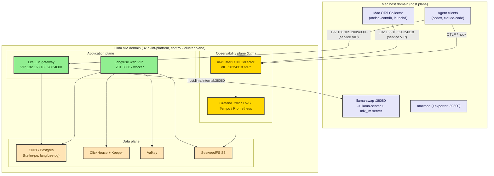
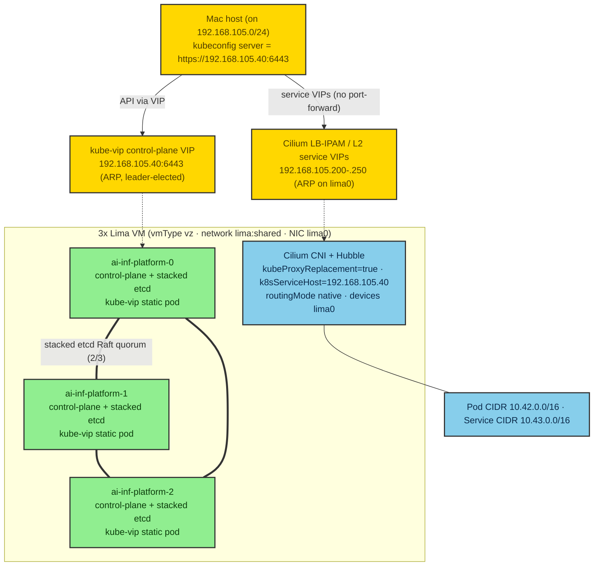
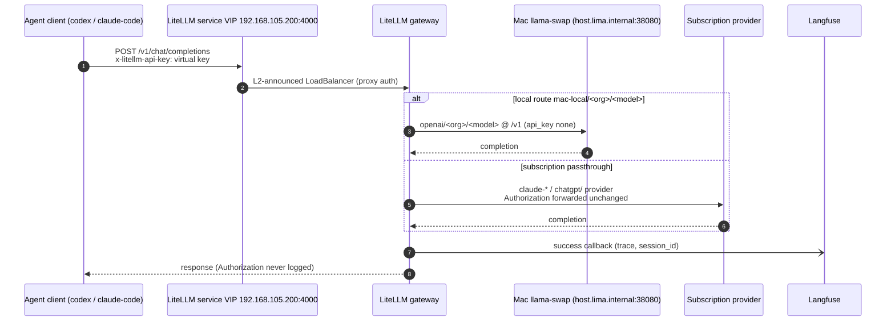
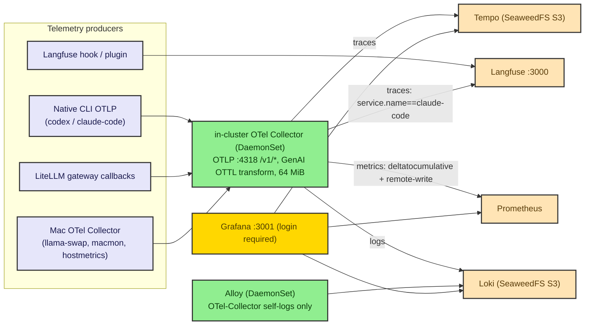

# Architecture

This is the deep architecture reference for the ai-infra-platform lab: the planes
and their components, the cluster topology, the request and telemetry data flows,
the trust boundaries, and the full diagram set (D01-D24). It is the companion to
the root [`README.md`](../README.md) architecture overview and to spec §4/§6/§12/§13.

> **Cluster substrate (v7 pivot — D005).** The cluster is upstream **kubeadm**
> Kubernetes with **Cilium** CNI in **kube-proxy-replacement** mode, running
> across **three control-plane Lima VMs** (`ai-inf-platform-0/1/2`, stacked etcd).
> Host↔cluster access is **direct over a real L2 network** (Lima `shared` /
> socket_vmnet, `192.168.105.0/24`): a **kube-vip** control-plane VIP fronts the
> API server, and **Cilium LB-IPAM + L2 announcements** give each host-facing
> service a stable LoadBalancer VIP on that subnet. `kubectl port-forward` is kept
> only as a non-HA fallback. The address block `192.168.105.0/24` is a generic
> local subnet. The §6.2 HA replica/PDB/anti-affinity policy is unchanged.

> Representative diagrams below are hand-validated, high-contrast Mermaid blocks
> embedded inline (D01, D03, D14, plus the request flow D15). They use the standard
> `classDef` palette shared across this docs set and parse as `flowchart` /
> `sequenceDiagram`.

## 1. Two host domains and four in-cluster planes

The platform spans **two host domains** bridged by a real L2 network, and
organizes its in-cluster workloads into **four planes**.

- **Mac host domain** (host plane) — Homebrew-managed model serving and host
  telemetry, running directly on macOS / Apple Silicon outside the VMs.
- **Lima VM domain** (cluster plane) — **three** Lima virtual machines
  (`ai-inf-platform-0/1/2`) that together host the 3-node stacked-etcd HA **kubeadm**
  Kubernetes cluster and its Cilium CNI.
- Inside the cluster: the **application plane**, the **data plane**, and the
  **observability plane**.

The seam between the two domains is the Lima **`shared` (socket_vmnet) network**,
a real L2 segment on `192.168.105.0/24` that the Mac and all three VMs share. The
VMs reach Mac host services at `host.lima.internal`; the Mac reaches in-cluster
services **directly by VIP** on that subnet — the **kube-vip control-plane VIP**
`192.168.105.40:6443` for the API server, and **Cilium LB-IPAM / L2-announced
LoadBalancer VIPs** in `192.168.105.200-192.168.105.250` for the host-facing
services (LiteLLM `.200`, Langfuse-web `.201`, Grafana `.202`, in-cluster OTel
OTLP `.203`, Hubble UI `.204`). Because the Mac is on the same L2, a `curl` to any
of these VIPs reaches the service with **no port-forward**. `kubectl port-forward`
to `127.0.0.1` is kept only as a **non-HA fallback** (it cannot forward a VIP and
breaks on node loss). There is no overlay-VPN exposure and no public ingress.

Representative D01 (high-level architecture):

## 2. Planes and components

Each component is named with its role, namespace, replica / quorum target, and
the chart or manifest that deploys it. Replica/quorum values are the canonical
§6.2 HA matrix; see [`ha-and-reliability.md`](ha-and-reliability.md) for the full
matrix and chart pins in [`chart-selection.md`](chart-selection.md).

### 2.1 Host plane (Mac, Homebrew + launchd)

| Component | Role | Where | Deployed by |
|---|---|---|---|
| llama-swap | On-demand model front (`:38080`) routing to backends | Mac host | Homebrew / `brew services` |
| llama-server (`llama.cpp`) | GGUF model serving backend | Mac host | Homebrew, fronted by llama-swap |
| `mlx_lm.server` (`mlx-lm`) | Apple-Silicon MLX model backend | Mac host | Homebrew, fronted by llama-swap |
| macmon (+ exporter) | Apple-Silicon hardware metrics (`:39300`) | Mac host | Homebrew |
| Mac OTel Collector | Host telemetry OTLP shipper (`otelcol-contrib`) | Mac host | manual binary + launchd user agent |

The host plane is managed by Homebrew (services) and mise (the repo command
surface); see [`developer-workflows.md`](developer-workflows.md).

### 2.2 Control / cluster plane (Lima VM)

| Component | Role | Namespace | Replicas / quorum | Deployed by |
|---|---|---|---|---|
| kubeadm control plane | 3 control-plane nodes, **stacked etcd** HA (taint removed → workloads schedule on all 3) | host-level | 3 nodes (etcd Raft, tolerates 1 loss) | Lima `k8s-cilium` template + kubeadm init/join |
| kube-vip | Control-plane VIP (`192.168.105.40:6443`), ARP mode, leader-elected | `kube-system` (static pod, 1/CP node) | 1 active holder (leader election) | static pod in `/etc/kubernetes/manifests` |
| Cilium agent | CNI dataplane (`kubeProxyReplacement=true`) | `kube-system` | DaemonSet (1/node) | `cilium` chart |
| Cilium operator | CNI control + LB-IPAM | `kube-system` | 2 | `cilium` chart |
| Cilium LB-IPAM / L2 announcer | Service VIPs on `192.168.105.200-.250` over `lima0` | `kube-system` | per agent (leader per IP) | `CiliumLoadBalancerIPPool` + `CiliumL2AnnouncementPolicy` |
| Hubble (relay + UI + metrics) | Network observability (UI at VIP `.204`) | `kube-system` | per Cilium chart | `cilium` chart |

### 2.3 Application plane

| Component | Role | Namespace | Replicas | Deployed by |
|---|---|---|---|---|
| LiteLLM gateway | OpenAI/Anthropic-compatible gateway | `litellm` | >=2 | **raw manifests** |
| Langfuse web | Trace UI + ingest API | `langfuse` | 2 | `langfuse` chart |
| Langfuse worker | Async ingest / batch export | `langfuse` | 2 | `langfuse` chart |

### 2.4 Data plane

| Component | Role | Namespace | Replicas / quorum | Deployed by |
|---|---|---|---|---|
| CNPG `litellm-pg` | LiteLLM Postgres | `litellm` | 3 instances, quorum-sync | CNPG operator CR |
| CNPG `langfuse-pg` | Langfuse Postgres | `langfuse-data` | 3 instances, quorum-sync | CNPG operator CR |
| ClickHouse `langfuse-ch` | Langfuse analytics store | `langfuse-data` | shards 1 / replicas 2 (ReplicatedMergeTree) | Altinity operator CHI |
| ClickHouse Keeper | Coordination quorum | `langfuse-data` | 3 (Raft) | Altinity operator CHK |
| Valkey `langfuse-valkey` | BullMQ queue + cache | `langfuse-data` | 3 (1 primary + 2 replica) | `valkey` chart |
| SeaweedFS `langfuse-seaweedfs` | S3 object store | `langfuse-data` | master 3 / volume 3 / filer 2 | `seaweedfs` chart |

The CNPG and Altinity **operators** live in `cnpg-system` and
`clickhouse-system`; they reconcile the CRs above.

### 2.5 Observability plane (`lgtm`)

| Component | Role | Namespace | Replicas | Deployed by |
|---|---|---|---|---|
| Grafana | UI + datasources + dashboards | `lgtm` | 2 (CNPG-backed DB) | `grafana` chart |
| Loki | Logs (SimpleScalable on SeaweedFS S3) | `lgtm` | read 2 / write 2 / backend 2, RF 2 | `loki` chart |
| Tempo | Traces (single-binary on SeaweedFS S3) | `lgtm` | 1 (documented HA exception) | `tempo` chart |
| Prometheus | Metrics (standalone, remote-write receiver) | `lgtm` | 2 (no cross-replica dedup) | `prometheus` chart |
| in-cluster OTel Collector | THE OTLP gateway + general log path | `lgtm` | DaemonSet (1/node) | `opentelemetry-collector` chart |
| Alloy | Meta-observability (OTel Collector self-logs only) | `lgtm` | DaemonSet (1/node) | `alloy` chart |

All datasource URLs and OTLP exporters resolve `*.lgtm.svc.cluster.local`; see
the routing detail in [`observability-taxonomy.md`](observability-taxonomy.md).

## 3. Cluster topology

Representative D03 (cluster topology):

Topology facts (D005, [`ha-and-reliability.md`](ha-and-reliability.md)):

- **Nodes** `ai-inf-platform-0`, `ai-inf-platform-1`, `ai-inf-platform-2` — all **control-plane** nodes
  (the control-plane taint is removed so workloads schedule on all three), fixed
  4 CPU / 8 GiB / 50 GiB each, with the §7.2 escalation policy as the resolution
  process if the HA stack exceeds the default budget.
- **Stacked-etcd HA (kubeadm)**: `ai-inf-platform-0` runs `kubeadm init` first (the
  `init` role); `ai-inf-platform-1` and `ai-inf-platform-2` `kubeadm join --control-plane` **via the
  VIP** (`192.168.105.40:6443`), sequentially, pulling the uploaded cert set
  (`--upload-certs` / `certificateKey`). etcd Raft quorum tolerates one node loss.
- **kube-vip control-plane VIP**: a `ghcr.io/kube-vip/kube-vip:v1.2.0` static pod
  on each control-plane node ARP-announces the VIP `192.168.105.40` on `lima0` and
  leader-elects (lease `plndr-cp-lock`); exactly one node holds it, so the API
  endpoint survives any single-node loss with ~5s failover. It is **control-plane
  only** (`cp_enable=true`, `svc_enable` omitted) — Cilium owns all service VIPs.
- **Networking — the pivot**: the VMs attach the Lima **`shared`** (socket_vmnet)
  network — a real L2 `192.168.105.0/24` with guest NIC **`lima0`** (the SLIRP NAT
  `eth0` is never used for cluster traffic). The Mac is on the same L2 and reaches
  every node IP, the VIP, and the service VIPs directly.
- **Cilium (1.19.5)** is the CNI in **kube-proxy-replacement** mode
  (`kubeProxyReplacement: true`, `k8sServiceHost: 192.168.105.40`,
  `k8sServicePort: 6443` — it **must** be the VIP, since with no kube-proxy there
  is no `kubernetes` ClusterIP to bootstrap from). It runs `routingMode: native`
  (`ipv4NativeRoutingCIDR: 10.42.0.0/16`, `autoDirectNodeRoutes: true`) over
  `devices: lima0`, `ipam.mode: kubernetes`, `operator.replicas: 2`, with Hubble
  (relay + UI + metrics; UI at VIP `.204`). Tunnel (vxlan) is the documented
  fallback if native pod-to-pod routing proves flaky live.
- **Service VIPs** come from a `CiliumLoadBalancerIPPool` (`lima-shared-pool`,
  blocks `192.168.105.200-.250`) and are announced by a
  `CiliumL2AnnouncementPolicy` (`lima-lb-l2`, `interfaces: ['^lima0$']`,
  control-plane nodeSelector). Each host-facing Service is `type: LoadBalancer`
  with `loadBalancerClass: io.cilium/l2-announcer`,
  `externalTrafficPolicy: Cluster`, and a fixed IP via the
  `lbipam.cilium.io/ips` annotation.
- **CIDRs**: pod CIDR `10.42.0.0/16`, service CIDR `10.43.0.0/16` (kubeadm
  `podSubnet`/`serviceSubnet`, kept in sync with Cilium IPAM); `vmType: vz` with
  writable virtiofs **host mounts** (see §3.1).

### 3.1 Host mounts and node-pinned storage

Each VM gets writable **virtiofs** mounts under the gitignored repo path
`./.local/lima/{vm-name}/{storage,config}` (rendered via the Lima `repoRoot`
param + `{{.Name}}`; the bootstrap `mkdir -p`s them before `limactl start`):

- `…/{{.Name}}/storage` → guest `/mnt/lima/storage` — the **rancher
  local-path-provisioner** root (`nodePathMap` default path + a default
  `WaitForFirstConsumer` StorageClass). PVC/replica data lands in the host mount:
  host-visible, survives a VM rebuild, and is per-node (each VM has its own host
  backing dir). Because the mount is **node-pinned**, store HA still comes from
  the store's own replication/quorum, not from the mount (see
  [`ha-and-reliability.md`](ha-and-reliability.md)).
- `…/{{.Name}}/config/<svc>` → guest `/mnt/lima/config/<svc>` — editable service
  config (primarily the LiteLLM `proxy_config`, optionally the OTel Collector
  config), so the operator can edit it on the Mac and have the pod read it.

The control-plane detail is captured by the topology facts above: kubeadm
init/join always goes through the kube-vip VIP, the API certificate includes that
VIP, kube-proxy is skipped, and Cilium owns the pod/service CIDRs plus service
VIP announcements.

## 4. Trust and isolation boundaries

The boundaries nest, outermost to innermost:

1. **Mac host** — the outer trust domain. Holds the operator's subscription
   credentials and the fnox+age private key, both of which never leave the host.
   It is on the `192.168.105.0/24` L2 but exposes nothing of its own beyond
   `host.lima.internal` to the VMs.
2. **Lima VMs (x3)** — the virtualization boundary. The cluster runs entirely
   inside the three VMs; the inbound path from the Mac is **direct to a VIP** on
   the shared L2 (the kube-vip API VIP `192.168.105.40:6443`, or a Cilium service
   VIP in `192.168.105.200-.250`) — `kubectl port-forward` is a non-HA fallback,
   not the primary seam. The only outbound path to the Mac is
   `host.lima.internal` (for local model serving).
3. **kubeadm cluster** — the orchestration boundary. Cilium provides pod
   networking and can enforce NetworkPolicy, but this repo does not yet install a
   default-deny policy set. The current lab boundary is the private Lima L2,
   service VIPs, namespace separation, and workload auth (LiteLLM virtual key,
   Grafana/Langfuse login). The ClickHouse default-user `::/0` allowance remains
   a production hardening backlog item until Cilium NetworkPolicy allowlists are
   live-validated.
4. **Namespace** — the workload boundary: `litellm`, `langfuse`, `langfuse-data`,
   `lgtm`, plus the operator namespaces `cnpg-system` / `clickhouse-system` and
   Cilium/kube-vip/Hubble in `kube-system`. Cross-namespace traffic uses
   `*.svc.cluster.local` DNS.
5. **Pod** — the process boundary, with PDBs, anti-affinity, and probes per the
   HA matrix.

The seam is deliberately bidirectional but narrow: requests flow Mac -> cluster
to a VIP on the shared L2; model calls and host-telemetry pull flow cluster ->
Mac via `host.lima.internal`. No value crosses either direction except over
these two seams.

## 5. Data flows

### 5.1 Request flow (single agent turn)

Representative D15 (request flow):

The request path (spec §9):

- Client posts to `192.168.105.200:4000` (the LiteLLM LoadBalancer service VIP,
  reachable directly from the Mac on the shared L2; `127.0.0.1:34000` via
  `port-forward:litellm` is the non-HA fallback), authenticating to the proxy with the
  default `x-litellm-api-key` header carrying its per-client virtual key.
- **Local route**: `mac-local/<org>/<model>` resolves to
  `openai/<org>/<model>` at `http://host.lima.internal:38080/v1` (`api_key:
  "none"`), i.e. the Mac llama-swap front.
- **Subscription passthrough**: the client's `Authorization` (subscription OAuth)
  is forwarded unchanged (`forward_client_headers_to_llm_api: true`) and never
  logged — `claude-*` to `anthropic/claude-*`, Codex via the native `chatgpt/`
  provider. There is no `ANTHROPIC_API_KEY` anywhere.
- Parallel **callbacks** fire to Langfuse (success/failure) and the OTel /
  Prometheus callbacks, stamped with the `session.id` join key
  (`langfuse_session_id_header: X-Claude-Code-Session-Id`).

### 5.2 Telemetry flow

Representative D14 (telemetry dataflow):

The telemetry path (spec §13):

- App SDKs and the Mac-side OTel Collector send OTLP to the **in-cluster OTel
  Collector OTLP gateway** at `:4318` on the standard `/v1/{traces,metrics,logs}`
  paths (no `/otel` prefix; the Mac collector reaches it directly at the service
  VIP `http://192.168.105.203:4318/v1/*`, or `http://127.0.0.1:34318/v1/*` via the
  `port-forward:otel` fallback).
- The gateway fans out: all traces to Tempo; `service.name==claude-code` spans
  *additionally* to Langfuse; metrics to Prometheus via remote-write (with
  `deltatocumulative` for Codex delta metrics); logs to Loki.
- The **GenAI OTTL transform** rewrites Claude Code attributes into OpenTelemetry
  GenAI semantic conventions so Langfuse auto-extracts prompts, completions, and
  token usage — the keystone of the telemetry design.

### 5.3 OTel Collector vs Alloy division (explicit)

The in-cluster **OpenTelemetry Collector IS the OTLP gateway** and the general
log path: it owns the OTLP receivers, the GenAI OTTL transform, the fan-out
pipelines, and the `filelog` tail for general container logs. **Alloy is narrow
meta-observability** — its only job is to ship the OTel Collector's *own* pod logs
to Loki (closing the gap where the collector cannot reliably log about its own
export failures). Alloy is NOT the general log path; do not present it as one.

### 5.4 Secret and ops flows

- **Secret flow**: `fnox decrypt` -> gitignored `.dec` -> kustomize
  `secretGenerator.envs` -> runtime k8s Secrets consumed via `secretKeyRef`;
  CNPG mints the Postgres `uri` Secret. Full lifecycle in
  [`secrets.md`](secrets.md) (D12 / D16).
- **Ops flow**: the cluster comes up first via `mise run init` (host prereqs:
  socket_vmnet sudoers, mmdc Chrome, age key, secrets) then `mise run up`
  (host services -> `lima:start` 3-VM kubeadm bring-up -> kubeconfig -> Cilium ->
  `k8s:apply`). Deploy order is operators -> cilium -> namespaces ->
  langfuse-data (stores) -> litellm/langfuse -> lgtm -> service-VIP exposure
  (D18). Teardown (`cluster:teardown`) runs the Cilium-interface + iptables
  cleanup and `kubeadm reset` on each node, then deletes the VMs (D22). See
  [`developer-workflows.md`](developer-workflows.md) and
  [`kubernetes/README.md`](../kubernetes/README.md).

The component dependency graph is summarized in [`chart-selection.md`](chart-selection.md):
operators and Cilium establish the substrate, stores come up before the
application plane, and the observability plane receives signals from every other
plane.

## 6. HA and failure domains

Which components tolerate a node loss and how:

- **kubeadm control plane / etcd** — 3 control-plane nodes, stacked-etcd Raft
  quorum (tolerates 1 loss); the API endpoint stays up via the kube-vip VIP
  (leader re-election + ARP re-announce, ~5s).
- **CNPG Postgres** — `instances: 3` with quorum-sync (`method: any`,
  `number: 1`): RPO ~ 0 for acknowledged writes; operator-driven failover.
- **ClickHouse** — shards 1 / replicas 2 (ReplicatedMergeTree) with a 3-node
  Keeper Raft quorum; surviving replica serves through a single-node loss.
- **Valkey** — 1 primary + 2 replicas, `minReplicasToWrite: 1`; persistence off
  (BullMQ re-enqueues on reconnect).
- **SeaweedFS** — master Raft 3 (tolerates 1), volume 3 with replication `001`
  (2 copies on distinct nodes), filer 2; RPO 0 for committed chunks.

Full failure-injection scenarios, per-store RPO/RTO, documented HA exceptions
(Tempo single-binary, Prometheus no-dedup), and recovery runbooks are in
[`ha-and-reliability.md`](ha-and-reliability.md) (D08 / D21).

## 7. Service-VIP access table

Host-facing services are reached **directly by VIP** on the shared L2
(`192.168.105.0/24`) — no port-forward, and the path survives a node loss
(Cilium re-announces the VIP from a surviving node). There are no NodePorts and
no anonymous access; the workload behind each VIP still requires its own auth. A
`port-forward:*` task is kept as a **non-HA fallback** that binds `127.0.0.1`.

| Service | In-cluster target | Service VIP (primary) | Fallback (port-forward) | Auth | Fallback task |
|---|---|---|---|---|---|
| LiteLLM gateway | `svc/litellm:4000` | `192.168.105.200:4000` | `127.0.0.1:34000` | Virtual / master key required | `port-forward:litellm` |
| Langfuse UI | `svc/langfuse-web:3000` | `192.168.105.201:3000` | `127.0.0.1:33000` | Login required | `port-forward:langfuse` |
| Grafana | `svc/grafana:3000` | `192.168.105.202:3000` | `127.0.0.1:33001` | Login required (no anon) | `port-forward:grafana` |
| OTLP/HTTP ingest | `svc/otel-collector:4318` | `192.168.105.203:4318` | `127.0.0.1:34318` | In-cluster collector | `port-forward:otel` |
| Hubble UI | `svc/hubble-ui:80` | `192.168.105.204` | `127.0.0.1` (cilium-cli) | In-cluster | `cilium hubble ui` |
| Kubernetes API | apiserver | `192.168.105.40:6443` (kube-vip VIP) | — | kubeconfig | — |

Each LoadBalancer Service pins its VIP with the `lbipam.cilium.io/ips`
annotation, `loadBalancerClass: io.cilium/l2-announcer`, and
`externalTrafficPolicy: Cluster`. OTLP/HTTP uses plain `:4318` with
`/v1/{traces,metrics,logs}` paths (no `/otel` prefix); gRPC `:4317` is shared on
the same `.203` VIP. Backends not in this table (Prometheus, Loki, Tempo,
Postgres, ClickHouse, Valkey, SeaweedFS, kube-state-metrics, hubble-relay) stay
ClusterIP and are reached through Grafana or a port-forward.

NetworkPolicy is intentionally not claimed as a current control. A production
upgrade should add default-deny to app/data/observability namespaces plus explicit
allows for kube-dns, operator-managed webhooks/reconciliation, LiteLLM and Langfuse
cross-namespace dependencies, LGTM scraping, OTLP fan-out, and Cilium service-VIP
health paths. Add it only with live validation so service VIP and observability
behavior are not broken by a blind deny.

## Related docs

- [`README.md`](../README.md) — project landing page and quickstart.
- [`observability-taxonomy.md`](observability-taxonomy.md) — telemetry identity and signal routing.
- [`ha-and-reliability.md`](ha-and-reliability.md) — HA matrix, exceptions, failure/recovery.
- [`chart-selection.md`](chart-selection.md) — chart provenance and pins.
- [`secrets.md`](secrets.md) — fnox+age secret model.
- [`developer-workflows.md`](developer-workflows.md) — mise task surface and bring-up.
- [`troubleshooting.md`](troubleshooting.md) — common gotchas.
- [`demo-walkthrough.md`](demo-walkthrough.md) — end-to-end demo.
- [`kubernetes/README.md`](../kubernetes/README.md) — apply order and render commands.
