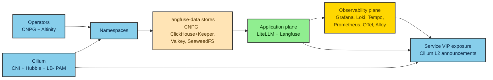

# Chart Selection and Provenance

This document records the chart/image provenance and the exact version pins for
every deployed component, the no-Bitnami posture and how it is enforced, the
rationale for deploying LiteLLM via raw manifests and externalizing every data
store, and the Grafana-community repo migration that affects chart sourcing. It is
the companion to spec §6.6/§6.7 and §13.1.

> **Pins are recommendations as of 2026-06-19.** These charts release multiple
> times per week. The implementation MUST pin **exact** versions (no `latest`, no
> ranges, no `>=`), re-verify each pin and its repo of record against upstream
> immediately before authoring manifests, confirm Bitnami-freedom of the rendered
> output, and record any deviation in the repo CHANGELOG with the verification date.

## 1. Provenance and version-pin table

"Bitnami in path used?" reflects the deployment path this platform actually uses,
not what an upstream chart merely declares for an unused option.

| Component | Chart / artifact | Repository of record | Pinned chart version | App / image version | Why this source |
|---|---|---|---|---|---|
| Cilium CNI | `cilium` | `https://helm.cilium.io/` | 1.20.0-rc.0 | 1.20.0-rc.0 | CNCF in-tree CNI; no subcharts; excellent release cadence |
| CloudNativePG operator | `cloudnative-pg` | `https://cloudnative-pg.github.io/charts` | 0.29.0 | 1.30.0 (Postgres 18) | CNCF Sandbox, project-official operator; no Bitnami in path |
| Postgres (DB) | CNPG `Cluster` CR | n/a — operator-managed (no chart) | — | Postgres 18 | operator-managed; no bundled image |
| Altinity ClickHouse operator | `altinity-clickhouse-operator` | `https://helm.altinity.com` | 0.27.1 | 0.27.1 (operator only; CHI/CHK server images pinned independently) | vendor-official; chart's `crdHook.image` default is overridden (see §3) |
| ClickHouse (DB) | Altinity `ClickHouseInstallation` / `ClickHouseKeeperInstallation` CRs | n/a — operator-managed | — | ClickHouse 26.3.17.56 (26.3 LTS) | operator-managed; no bundled image |
| Valkey | `valkey` (valkey-io / valkey-helm) | `https://valkey.io/valkey-helm` | 0.10.0 | 9.1.0 | Valkey-project community chart — the correct Bitnami-Redis replacement; no `dependencies:` block |
| SeaweedFS (S3) | `seaweedfs` | `https://seaweedfs.github.io/seaweedfs/helm` | 4.40.0 | 4.40 | project-official, in-monorepo; no Bitnami |
| Langfuse (web + worker) | `langfuse` | `https://github.com/langfuse/langfuse-k8s` | 1.5.40 | 3.212.0 (image overridden to 3.222.0) | vendor-official; all bundled subcharts `deploy: false` (see §2) |
| LiteLLM gateway | **RAW manifests** (image only) | image registry only — chart NOT used | — | `ghcr.io/berriai/litellm-database:v1.93.0` | official chart carries Bitnami pg/redis; raw manifests avoid it (see §4) |
| Grafana | `grafana` | `https://grafana-community.github.io/helm-charts` (MIGRATED) | 12.7.3 | 13.1.1 | community-maintained, Grafana-endorsed fork (see §5) |
| Loki | `loki` | `https://grafana-community.github.io/helm-charts` (MIGRATED) | 18.5.1 | 3.7.x | community OSS fork; bundled MinIO is official `charts.min.io`, disabled |
| Tempo (single-binary) | `tempo` | `https://grafana-community.github.io/helm-charts` (MIGRATED) | 2.2.3 | 2.10.x | community OSS fork; bundled MinIO disabled |
| Tempo (distributed — HA option) | `tempo-distributed` | `https://grafana-community.github.io/helm-charts` (MIGRATED) | 2.25.4 | 2.10.x | pre-pinned HA option, gated behind §7.2 escalation (not deployed in v1) |
| Prometheus | `prometheus` (standalone) | `https://prometheus-community.github.io/helm-charts` | 29.18.0 | — | Prometheus Community / CNCF; standalone over kube-prometheus-stack (see §6) |
| OpenTelemetry Collector | `opentelemetry-collector` | `https://open-telemetry.github.io/opentelemetry-helm-charts` | 0.165.0 | 0.156.0 | CNCF first-party; no subcharts |
| Grafana Alloy | `alloy` (from `grafana/alloy`) | `https://grafana.github.io/helm-charts` | 1.10.1 | v1.18.0 | Grafana Labs first-party; published from the Alloy repo (NOT grafana-community) |

Operator tooling and CLIs are pinned separately in the root `mise.toml` `[tools]`
(age, fnox, kubectl 1.36.2, kustomize 5.8.1, helm 4.2.3, cilium-cli 0.19.5, plus
node/python/ripgrep + `npm:@mermaid-js/mermaid-cli` for the docs toolchain and the
lint/format set). The kubeadm Kubernetes version is pinned in the Lima
`k8s-cilium` template, identical on all three control-plane nodes; **kube-vip** is
`ghcr.io/kube-vip/kube-vip:v1.2.1`. See [`developer-workflows.md`](developer-workflows.md)
for the file-task surface.

## 2. No-Bitnami posture

The platform forbids **any Bitnami chart or image, direct or transitive** —
including the frozen/relicensed legacy image set. The posture is structural:

- **Externalized stores instead of bundled subcharts.** Every store is a
  community/CNCF operator or project-official chart (CNPG, Altinity, valkey-io,
  SeaweedFS) — none pulls a Bitnami image in its deployment path.
- **Langfuse bundled subcharts are all `deploy: false`.** The Langfuse chart
  *declares* Postgres/ClickHouse/Redis/S3 subcharts (some Bitnami-derived), but all
  of them are disabled; Langfuse connects to the externalized stores instead.
- **Charts that default to a Bitnami image have it overridden.** The Altinity
  operator's `crdHook` init step defaults to a Bitnami `kubectl` image; that image
  is overridden to a pinned non-Bitnami image. LiteLLM's official chart's
  Bitnami-derived `wait-for-postgres` init container is avoided entirely by using
  raw manifests with a non-Bitnami pg client (`pg_isready` from a pinned
  `postgres:18-alpine`-class image).
- **Loki/Tempo bundled MinIO** is the official `charts.min.io` image and is
  **disabled** anyway (object storage is SeaweedFS S3, not MinIO).

**Enforcement greps RENDERED output, not the chart cache.** The CI no-Bitnami
guard renders every kustomize base with `kustomize build --enable-helm` and greps
the rendered manifests for Bitnami image references, so a transitively-pulled
Bitnami image cannot slip through. Run it via `mise run validate:no-bitnami`.

## 3. Why externalize every store

Bitnami's chart/image licensing and the relicensing of its legacy image set make
bundled subcharts a publication and reproducibility liability for a published repo.
Externalizing onto CNCF/community operators is both **more production-like** (real
operators, real CRs, real quorum) and **avoids shipping a public repo that depends
on Bitnami artifacts**. Separate CNPG clusters back Langfuse (`langfuse-pg`) and
LiteLLM (`litellm-pg`) so the two apps never share a database. The guard grepping
*rendered* output is what makes "no transitive Bitnami" enforceable rather than
aspirational.

## 4. Why LiteLLM via raw manifests

LiteLLM is the **single component deployed as raw Kubernetes manifests** (Deployment
+ Service + ConfigMaps + key-mint Jobs), not via the official Helm chart, because
that chart bundles Bitnami Postgres/Redis. The raw-manifest path:

- uses the `-database` image variant (`ghcr.io/berriai/litellm-database:v1.93.0`,
  which bakes in Prisma/Postgres for `store_model_in_db`), pinned exactly;
- connects to the dedicated CNPG cluster `litellm-pg` (reached as `litellm-pg-rw`)
  via the CNPG-minted `uri` Secret;
- replaces the chart's Bitnami `wait-for-postgres` init container with a
  non-Bitnami `pg_isready` init container;
- sets `replicas: >= 2` with `RollingUpdate` (the source's single replica +
  `Recreate` is overridden for HA).

## 5. Grafana / Loki / Tempo repo migration

As of **2026-03-16**, the OSS Grafana Helm charts for `grafana`, `loki`, `tempo`,
and `tempo-distributed` were forked to the community-maintained repository
**`grafana-community/helm-charts`**
(`https://grafana-community.github.io/helm-charts`; OCI
`oci://ghcr.io/grafana-community/helm-charts/<chart>`). v7 **MUST** pull these
charts from the migrated `grafana-community` repository, **not** the legacy
`grafana.github.io/helm-charts` index. This is the single most significant
provenance change in the stack — re-verify at implementation time that the repo of
record has not moved again.

**Alloy is the exception:** it is published from the `grafana/alloy` repo via
`grafana.github.io/helm-charts`, which is distinct from BOTH the legacy
`grafana/helm-charts` chart directory AND the new `grafana-community` repo. Do NOT
attempt to pull Alloy from `grafana-community`.

## 6. Why standalone Prometheus (not kube-prometheus-stack)

The platform uses the standalone `prometheus-community/prometheus` chart (29.18.0),
deliberately chosen over `kube-prometheus-stack`. The standalone chart matches the
hand-tuned scrape-config investment — the `/prometheus` route-prefix, the static
`extraScrapeConfigs`, and the OTLP remote-write receiver. `kube-prometheus-stack`
would force migrating every static scrape job to ServiceMonitor/PodMonitor CRDs and
would bundle a duplicate Grafana, node-exporter, and kube-state-metrics. It is noted
only as the eventual managed-cluster path, out of v7 scope. Mimir, Thanos,
Pyroscope, OpenLIT, and Vector.dev are all out of scope.

## 7. Build mechanism

Charts are inlined via kustomize `helmCharts:` (each pins
name/repo/version/releaseName/namespace/valuesFile, with `includeCRDs` where the
chart ships CRDs), rendered with `kustomize build --enable-helm`. Charts are
vendored locally so the build is reproducible offline after the first pull. The
per-component layout is `kustomization.yaml` + `values.yaml` + `patches/` +
`README.md` (chart provenance + pin + apply notes). LiteLLM is the lone raw-manifest
exception. See [`kubernetes/README.md`](../kubernetes/README.md) for the apply order
and render commands.

## 8. Dependency graph

The deploy-order dependency chain (operators reconcile CRs; CNI precedes
workloads; stores precede the apps that connect to them):

## Related docs

- [`architecture.md`](architecture.md) — planes, components, and which chart deploys each (D17).
- [`ha-and-reliability.md`](ha-and-reliability.md) — replica/quorum targets per component.
- [`developer-workflows.md`](developer-workflows.md) — render and apply tasks.
- [`kubernetes/README.md`](../kubernetes/README.md) — apply order and render commands.
- [`README.md`](../README.md) — project landing page.
