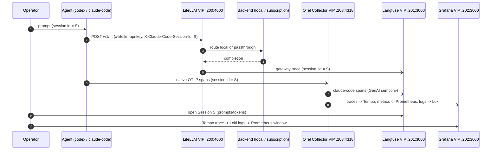
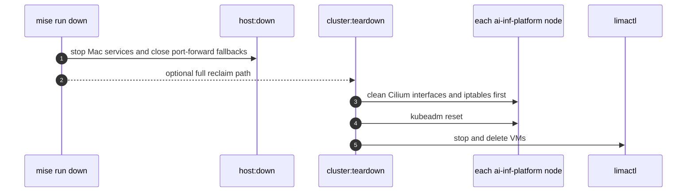

# Demo Walkthrough

This is the reproducible end-to-end demonstration that proves the stack works: from
cluster up, through planes up, an agent turn, observing the trace in Langfuse and
Grafana, to teardown — all driven by mise tasks and the `session.id` join key. It is
the full version of the README demo flow (§14.1.6) and the companion to
[`developer-workflows.md`](developer-workflows.md) and
[`observability-taxonomy.md`](observability-taxonomy.md).

> Every command is a mise task; every publishable capture must be taken from a
> sanitized run that uses placeholder-safe values and redacts prompts, keys, tokens,
> and host-specific names.

Representative demo lifecycle (the `session.id` join):



## Step 0 — Initialize the host

One-time host init (full procedure in
[`developer-workflows.md`](developer-workflows.md)):

```bash
mise run init   # prereqs + brew bundle + mise install, node/mmdc + Chrome,
                # socket_vmnet sudoers, age keygen + seal/sync secrets, confirm VIP/pool
```

Expected: prerequisites satisfied — `/etc/sudoers.d/lima` present (the `shared`
socket_vmnet network needs it), `mmdc` resolves (`tools:mmdc-setup` ran), the age
key exists and the fnox ciphertext decrypts, and the VIP (`192.168.105.40`) and LB
pool (`192.168.105.200-.250`) are confirmed.

## Step 1 — Bring up the whole lab

```bash
mise run up   # host:up -> lima:start -> lima:kubeconfig -> k8s:cilium -> k8s:apply
```

`mise run up` chains the bring-up; the load-bearing observations:

- **Host services** (`host:up`): `mise run host:status` shows llama-swap +
  llama-server + `mlx_lm.server`, macmon, and the Mac OTel Collector running; the
  default chat-model path resolves via `AI_INFRA_DEFAULT_CHAT_MODEL_PATH`.
- **Cluster** (`lima:start`): the 3 Lima VMs come up on the `shared` L2;
  `ai-inf-platform-0` runs `kubeadm init`, then `ai-inf-platform-1`/`-2` `kubeadm join
  --control-plane` **via the VIP** (`192.168.105.40:6443`). `kubectl get nodes`
  shows `ai-inf-platform-0/1/2` all `Ready` (only after `k8s:cilium` is up — see
  [`troubleshooting.md`](troubleshooting.md)). Stacked-etcd quorum healthy (3
  nodes); the kube-vip API VIP and Cilium + Hubble healthy.
- **Platform** (`k8s:apply`): overlays apply in order (operators -> cilium ->
  namespaces -> stores -> apps -> lgtm -> service-VIP exposure). `mise run
  k8s:status` shows all data-store clusters at target replica/quorum (CNPG
  `langfuse-pg` / `litellm-pg` 3 instances; ClickHouse 2 replicas + 3-node Keeper;
  Valkey 1+2; SeaweedFS master 3 / volume 3 / filer 2), the application plane
  (LiteLLM >=2, Langfuse web/worker 2/2), and the observability plane (Grafana 2,
  Loki 2/2/2, Tempo 1, Prometheus 2, OTel Collector + Alloy DaemonSets).

Mint the LiteLLM virtual keys (`codex`, `claude-code`, `smoke-test`) via the
idempotent key-mint Job and complete the headless Langfuse bootstrap.

## Step 2 — Reach the UIs (service VIPs)

Browse the Cilium service VIPs directly on the shared L2 — no port-forward, all
require credentials:

- **LiteLLM** — [`http://192.168.105.200:4000`](http://192.168.105.200:4000) — gateway + admin UI (virtual key)
- **Langfuse** — [`http://192.168.105.201:3000`](http://192.168.105.201:3000) — trace UI (login)
- **Grafana** — [`http://192.168.105.202:3000`](http://192.168.105.202:3000) — dashboards (login)
- **Hubble** — [`http://192.168.105.204`](http://192.168.105.204) — network observability UI
- **OTLP/HTTP** — `http://192.168.105.203:4318/v1/*` — in-cluster OTel Collector ingest (not a browser URL)

The `port-forward:*` tasks (`port-forward:litellm` / `port-forward:langfuse` / `port-forward:grafana` / `port-forward:otel`) bind
`127.0.0.1` as a non-HA fallback if you cannot use the VIPs.

## Step 3 — Configure an agent and run a turn

Configure Claude Code Max passthrough
(`ANTHROPIC_BASE_URL=http://192.168.105.200:4000` — the LiteLLM service VIP; model
alias, forwarded client OAuth, LiteLLM proxy auth via the `x-litellm-api-key`
virtual key) and/or Codex subscription passthrough, plus a local-model route
(`mac-local/...` -> host llama-swap). Then launch and run a prompt:

```bash
claude                   # Claude runs directly — mise+fnox provide the env on `cd`
mise run codex:launch    # Codex needs its launcher (-c provider overrides + TTY via raw=true)
```

Run one prompt through each path (a local-model route and a subscription path). The
agent sends its `session.id` via `X-Claude-Code-Session-Id` (or `X-Session-Id`).

Evidence to capture after a real sanitized run: the agent command, one completed
response, the route used (local or subscription), and the `session.id` value used
for the later Langfuse/Grafana drilldown.

Expected observations:

- The request appears in LiteLLM (the gateway logged the call and applied the
  virtual key; the `Authorization` / `x-litellm-api-key` headers are never logged).
- A local-route turn was answered by the Mac llama-swap front; a subscription turn
  was answered by the provider with the client's own OAuth forwarded unchanged.

## Step 4 — Observe the trace in Langfuse

Open Langfuse (`192.168.105.201:3000`) and find the **Session** for your
`session.id`.

Evidence to capture after a real sanitized run: the Langfuse Session filtered to
the same `session.id`, showing gateway and CLI traces grouped together with
redacted prompt/tool content.

Expected observations:

- The turn appears as a generation trace with **prompts, tool calls, and token
  usage** captured (via the GenAI OTTL transform that maps Claude Code attributes
  to OpenTelemetry GenAI semantic conventions — the keystone feature).
- The gateway trace (from LiteLLM's `langfuse_session_id_header`) and the CLI's
  hook/plugin trace are unified under one Langfuse Session by `session_id`.

## Step 5 — Observe metrics, logs, and traces in Grafana

Open Grafana (`192.168.105.202:3000`, login required). The relevant dashboards:

- **LiteLLM dashboard** — gateway request rates, latency, token throughput.
- **Claude Code dashboard** — the `$model` template var; per-client activity.
- **macmon workstation dashboard** — host CPU/GPU/memory during the turn.

Evidence to capture after a real sanitized run: Grafana panels for LiteLLM
latency/token throughput, client activity, and macOS host load over the session's
time window.

Then walk the cross-signal drilldown keyed off the **`session.id`** join key:

1. In **Langfuse**, note the `session_id` (= S) for the turn.
2. In **Grafana -> Loki**, query with S as `conversation_id` to read the structured
   logs; Loki structured metadata carries `trace_id`.
3. Pivot to **Tempo** by `trace_id` (the reliable path; TraceQL by
   `.conversation.id` is unreliable) to see the full span tree — the pre-wired
   Tempo->Loki/Prometheus correlations make this one click.
4. In **Prometheus**, confirm the **time window** (request rates, token throughput,
   hardware load during the session's wall-clock span). Prometheus is window-only:
   it cannot isolate a single session (`session.id` is deliberately not a label).

For a publication demo, record the drilldown only after the live run exists and
has been redacted: Langfuse Session -> Loki logs -> Tempo span tree ->
Prometheus time window.

This is the whole point of the identity taxonomy: move from "which turn was slow or
wrong" in Langfuse, to the exact log lines in Loki, to the full span tree in Tempo,
to the hardware/throughput context in Prometheus — all keyed off one `session.id`,
with host telemetry joined by `host.name` / `source`. See
[`observability-taxonomy.md`](observability-taxonomy.md) for the full taxonomy.

## Step 6 — (Optional) reliability check

Exercise a failure-injection scenario to see HA in action:

```bash
mise run smoke:ha:node-loss   # limactl stop one VM; confirm VIPs keep serving
mise run smoke:ha:recovery    # restore; confirm re-quorum and consistency
```

Expected: quorum services (etcd, Keeper, SeaweedFS master) keep quorum (2/3); the
**kube-vip API VIP** re-elects/re-announces (~5s) and the **Cilium service VIPs**
re-announce from a surviving node, so the endpoint checks (made against the VIPs,
not port-forward) keep serving through the window; post-recovery the marker write
is present and consistent. See [`ha-and-reliability.md`](ha-and-reliability.md).

## Step 7 — Teardown

```bash
mise run down               # lima:stop + host:down (whole-lab reverse aggregator)
# or, to fully reclaim the VMs:
mise run cluster:teardown   # Cilium iface/iptables cleanup BEFORE kubeadm reset, then VM delete
```

Expected: host services stopped; any port-forwards closed; for a full teardown the
Cilium-interface + iptables cleanup runs **before** `kubeadm reset` on each node
(so a later bring-up has clean networking), and the VMs are stopped + deleted last.



## Related docs

- [`README.md`](../README.md) — quickstart and demo summary.
- [`developer-workflows.md`](developer-workflows.md) — the full mise task surface.
- [`observability-taxonomy.md`](observability-taxonomy.md) — the `session.id` taxonomy and drilldown.
- [`ha-and-reliability.md`](ha-and-reliability.md) — failure-injection scenarios.
- [`architecture.md`](architecture.md) — request and telemetry data flows.
- [`troubleshooting.md`](troubleshooting.md) — common gotchas.
