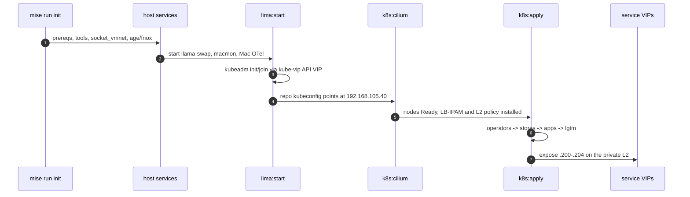
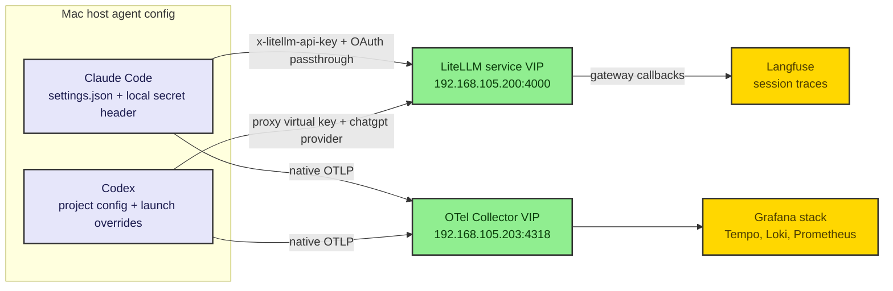
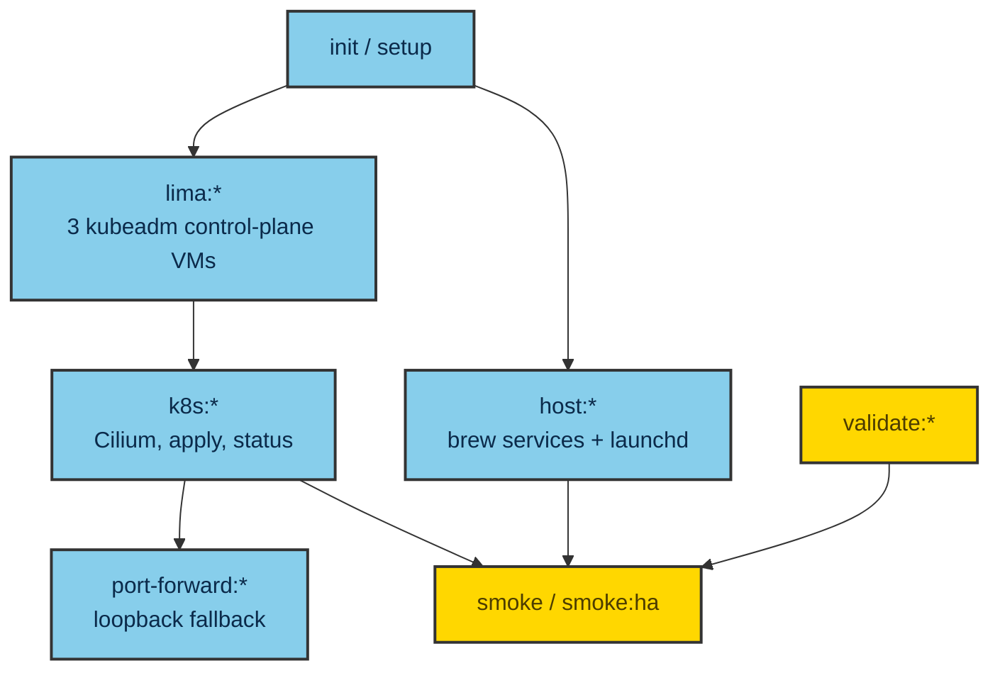
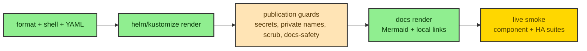

# Developer Workflows

This document is the full operator/developer command reference: the mise task
surface, the Homebrew-vs-mise boundary, the bootstrap flow, the secrets workflow,
the per-plane bring-up, the agent-configuration workflows, the host-service POC
lessons, and the pre-commit / CI setup. It is the companion to spec §7/§9/§10 and
to [`architecture.md`](architecture.md).

> **Prerequisite — bash 4+.** The repo's scripts require bash 4 or newer
> (associative arrays, `set -euo pipefail`, modern parameter expansion). macOS
> ships bash 3.2 at `/bin/bash`; install a current bash via Homebrew (it lands on
> the Homebrew bin path) and ensure that path precedes `/bin` so `#!/usr/bin/env
> bash` resolves to 5.x. The mise `.sh` file-tasks and sourced lib are
> formatted with `shfmt -i 2` and pass `shellcheck -s bash`.

> **Cluster substrate (v7 pivot — D005).** The cluster is upstream **kubeadm**
> Kubernetes + **Cilium** (kube-proxy-replacement) across **3 control-plane Lima
> VMs** (`ai-inf-platform-0/1/2`) on the `shared` socket_vmnet L2 (`192.168.105.0/24`); the
> Mac reaches the API via the **kube-vip VIP** `192.168.105.40:6443` and reaches
> services via **Cilium LB-IPAM VIPs** (`192.168.105.200-.204`) — loopback port-forward is
> a non-HA fallback. The mise surface is **`.config/mise/conf.d/*.toml` (tools +
> env + aggregators) + `.sh` file-tasks** under `.config/mise/tasks/`. See
> [`architecture.md`](architecture.md).

## 1. Homebrew vs mise boundary

The two tools own different surfaces and do not overlap:

- **Homebrew** manages **host services** — the long-running Mac-side processes:
  llama-swap (fronting `llama-server` and `mlx_lm.server`), macmon (+ exporter),
  and Mac-side Grafana Alloy (the `grafana-alloy` formula, binary `alloy`, run via a
  launchd user agent). Lifecycle is `brew services` (wrapped by mise tasks).
- **mise** manages the **repo command surface** — the pinned toolchain and
  non-secret environment in `.config/mise/conf.d/*.toml`, plus every operational
  task as a checked-in **file-task** under `.config/mise/tasks/<group>/<name>.sh`.

Non-secret env only ever lives in mise `[env]`; sensitive values live in fnox+age
(see [`secrets.md`](secrets.md)). No secret is ever placed in `[env]` or echoed to
logs.

## 2. mise configuration layout

The mise config lives under **`.config/mise/`** — there is **no root `mise.toml`**.
mise treats `.config/mise/conf.d/` as the project-root marker, merging every
`conf.d/*.toml` fragment in lexical order, and auto-discovers `.config/mise/tasks/`
as the task surface:

- **`.config/mise/conf.d/*.toml`** — the config, split into fragments merged in
  lexical order:
  - `00-tools.toml` — `[tools]` (the pinned toolchain).
  - `10-env.toml` — non-secret `[env]` (incl. `KUBECONFIG`, the port defaults, and
    the configurable cluster-IP `AI_INFRA_*` VIP/subnet vars).
  - `90-tasks.toml` — `[settings]` (`experimental = true` for the `npm:` backend)
    and the **depends-only aggregators** that have no body of their own
    (`setup`, `validate`, `smoke`, `smoke:ha`, `up`, `down`).
- **`.config/mise/tasks/<group>/<name>.sh`** — one executable file per task, with a
  `#!/usr/bin/env bash` shebang and a `#MISE description=…` (and optional
  `depends=` / `dir=`) header. mise **strips the `.sh`** for the task name. The
  **directory tree *is* the task surface**: nesting maps to `:` namespacing, so
  `.config/mise/tasks/lima/start.sh` is `mise run lima:start` and
  `.config/mise/tasks/smoke/ha/node-loss.sh` is `mise run smoke:ha:node-loss`. A
  `_default.sh` file (e.g. `k8s/cilium/_default.sh`) is the group's bare name
  (`k8s:cilium`).
- **`.config/mise/lib/`** — sourced helpers + data that are **not** tasks (mise
  does not auto-discover `lib/`): `common.sh`, `render-all.sh`, and the
  `forbidden-names.txt` data file.

Conventions for every file-task:

- `#!/usr/bin/env bash` + `set -euo pipefail`; robust repo-root via
  `${MISE_PROJECT_ROOT:-…git rev-parse…}`; source `.config/mise/lib/common.sh`
  defensively (with local fallbacks for `log_*`/`die`); **executable** (`+x`) or
  mise will not run it; pass `shellcheck -s bash` + `shfmt -i 2`.
- **Sourced helpers and data stay under `.config/mise/lib/`** and are **not**
  tasks (mise auto-discovers `.config/mise/tasks/` only, never `.config/mise/lib/`):
  `.config/mise/lib/common.sh`, `.config/mise/lib/render-all.sh`, and
  `.config/mise/lib/*.txt` (forbidden-names). These are
  sourced/called by file-tasks, never registered as tasks themselves. The former
  `scripts/scrub-guard.sh` and `scripts/validate/no-nodeport.sh` are now the
  `validate:scrub` and `validate:no-nodeport` file-tasks.

### 2.1 Redacted task logs

Mise file-tasks source `.config/mise/lib/common.sh`, which creates a task log
record automatically when the task starts. No wrapper command is required.

Default layout:

```text
.local/logs/mise/
  latest-run -> runs/YYYY-MM-DD/<run-id>
  runs/YYYY-MM-DD/<run-id>/<task-path>/
    metadata.env
    events.log
    stderr.log
    stdout.log   # debug mode only
  tasks/<task-path>/latest -> newest log dir for that task
```

Task paths use the file-task path form. For example, `k8s:apply` writes under
`runs/YYYY-MM-DD/<run-id>/k8s/apply/` and updates
`tasks/k8s/apply/latest`.

Modes:

| Mode | Behavior |
|---|---|
| `AI_INFRA_MISE_LOG_MODE=default` | metadata, structured `info`/`warn`/`err`/`log` events, and redacted stderr |
| `AI_INFRA_MISE_LOG_MODE=debug` | default mode plus redacted stdout capture |
| `AI_INFRA_MISE_LOG_MODE=metadata` | write only `metadata.env` |
| `AI_INFRA_MISE_LOG_MODE=off` | disable persisted task logging |

Set `AI_INFRA_MISE_LOG_DIR` to move the log root. Parent tasks export
`AI_INFRA_MISE_LOG_RUN_ID`, so nested task calls group under one run directory
instead of scattering across unrelated timestamps.

Security defaults:

- `secrets:*`, `codex:*`, and `claude:*` tasks are metadata-only.
- The `claude` / `codex` launcher tasks (and the retained `codex:launch`) record a
  pre-`exec` handoff timestamp in `metadata.env`; a successful `exec` replaces the shell,
  so no exit finalizer can run afterward. A bare `claude` / `codex` in a repo shell gets
  the same env without a task; see §3.4 / §6.1.
- Persisted streams are redacted for common secret shapes: bearer/basic auth,
  `x-litellm-api-key`, API key/token/password/private-key names, age secret
  keys, `sk-*` style keys, and credentials embedded in URLs.
- The logger never writes environment dumps, command argv, decrypted secret
  values, or stdout by default.
- Mise-native `redactions` are not the source of truth here: the current pinned
  mise rejects `redactions` in file-task headers, and `task.output` controls
  terminal display rather than persistent log files.

`golden-path` reports remain separate under `.local/reports/golden-path/`. If a
future report needs task-stream capture, route it through the same redaction
policy in `common.sh`.

## 3. mise task surface

### 3.1 Bootstrap and tooling

| Task | Does |
|---|---|
| `mise trust` / `mise install` | trust the config (one-time per machine), install the pinned `[tools]` toolchain |
| `init` | **interactive host init**: prereqs (bash4, brew bundle, mise install/trust), node + mmdc + Chrome, socket_vmnet secure path + `networks.yaml` socketVMNet fixup + `limactl sudoers`, age keygen, seal secrets, confirm VIP/pool — then points at `mise run up` |
| `setup` | non-interactive bootstrap aggregator: `prereq:check` -> `bootstrap` (brew bundle + `mise install`) -> `precommit:install` |
| `bootstrap` | one-shot host bootstrap (Homebrew, `brew bundle`, `mise install`, hooks) |
| `prereq:check` | verify host prerequisites (macOS/Apple Silicon, bash 4+, Lima) |
| `brew:check` / `brew:bundle` | check / install the `Brewfile` host services |
| `tools:mmdc-setup` | install the headless Chrome mermaid-cli needs (`npx puppeteer browsers install chrome`; the `npm:` backend + `--ignore-scripts` does not fetch it) |
| `precommit:install` / `precommit:run` | install and run the pre-commit hooks |

### 3.2 Cluster lifecycle (Lima + kubeadm + Cilium + kube-vip)

| Task | Does |
|---|---|
| `lima:start` | bring up the 3 Lima VMs and the 3-node HA **kubeadm** cluster: `ai-inf-platform-0` `kubeadm init` (role `init`) first, then `ai-inf-platform-1`/`-2` `kubeadm join --control-plane` **via the VIP** (sequential); the kube-vip static pod is placed before init/join |
| `lima:status` / `lima:stop` / `lima:delete` | status / stop / delete the VMs |
| `lima:recreate` | tear down and recreate the VMs |
| `lima:kubeconfig` | copy the repo-local kubeconfig (`server: https://192.168.105.40:6443`) to `KUBECONFIG` |
| `k8s:cilium` | install/upgrade Cilium 1.19.5 via Helm (`kubeProxyReplacement=true`, `k8sServiceHost=192.168.105.40`, LB-IPAM pool + L2 policy) and wait for it Ready |
| `cluster:teardown` | full teardown (Cilium iface/iptables cleanup BEFORE `kubeadm reset` on each node, then `limactl` stop + delete) |

### 3.3 Deploy and access

Host-facing services are reached **directly by service VIP** on the shared L2; the
`port-forward:*` tasks are the non-HA loopback fallback (they cannot follow a VIP failover).

| Task | Does |
|---|---|
| `k8s:apply` | apply all in-scope kustomize overlays in order (includes the LoadBalancer service-VIP patches) |
| `k8s:diff` | server-side dry-run diff against live state |
| `k8s:status` | rollout/health status of in-scope workloads |
| `port-forward:litellm` | fallback port-forward LiteLLM to `127.0.0.1:34000` (primary: VIP `192.168.105.200:4000`) |
| `port-forward:langfuse` | fallback port-forward Langfuse to `127.0.0.1:33000` (primary: VIP `192.168.105.201:3000`) |
| `port-forward:grafana` | fallback port-forward Grafana to `127.0.0.1:33001` (primary: VIP `192.168.105.202:3000`) |
| `port-forward:otel` | fallback port-forward the OTel Collector OTLP/HTTP to `127.0.0.1:34318` (primary: VIP `192.168.105.203:4318`) |

### 3.4 Host services and agents

| Task | Does |
|---|---|
| `host:up` / `host:down` / `host:status` | start / stop / status the Mac-side host services via `brew services` + launchd |
| `claude` / `codex` | launch Claude / Codex through the gateway with the full telemetry env (`raw=true`, real TTY); a bare `claude` / `codex` in a repo shell does the same (Codex via the committed `.config/bin/codex` PATH wrapper). `codex:launch` runs the same wrapper |
| `claude:no-gateway` / `codex:no-gateway` | canary the direct provider path (Claude: unset the two `ANTHROPIC_*` vars; Codex: drop the `--config` provider overrides) with all telemetry still captured |
| `codex:global-config` | merge the repo `[otel]`/trust/`[analytics]`/inert-provider blocks into `~/.codex/config.toml` (UTC-timestamped backup); run once per machine after `codex login` |

### 3.5 Secrets

| Task | Does |
|---|---|
| `secrets:keygen` | generate an age key (secret key gitignored), print the recipient |
| `secrets:seal` | encrypt real values into the gitignored `fnox.local.toml` ciphertext (no values printed) |
| `secrets:sync` | decrypt -> `.dec` -> kustomize `secretGenerator` -> apply -> remove `.dec` |
| `secrets:unseal` | (debug) decrypt to an inspectable `.dec` without applying |

(Secret task names are documented in full in [`secrets.md`](secrets.md).)

### 3.6 Validation, smoke, and aggregators

| Task | Does |
|---|---|
| `validate` | run the full local validation suite (depends-only aggregator) |
| `validate:fmt` / `validate:shell` / `validate:shfmt` / `validate:yaml` | format + lint shell and YAML; `validate:shell` / `validate:shfmt` lint every `.config/mise/tasks/**/*.sh` file-task plus `.config/mise/lib/*.sh` |
| `validate:helm-kustomize` | verify every `helmCharts:` entry pins an exact version (reject floating/`latest`), then render every kustomize base (`kustomize build --enable-helm`) |
| `validate:mermaid` | render every fenced ```mermaid block in README + `docs/**` with `mmdc -p .config/mermaid/puppeteer-config.json` (requires `tools:mmdc-setup` first) |
| `validate:docs-safety` | fail on visible media placeholders, stale substrate terms, broken local Markdown links, and docs-scope private-name leaks |
| `validate:no-bitnami` | grep RENDERED manifests for Bitnami images |
| `validate:private-names` / `validate:secrets` | scrub-list guard and secret scan (gitleaks) |
| `smoke` | component smoke suite (per-component `*:smoke` tasks) |
| `smoke:ha` (+ `smoke:ha:node-loss` / `:pod-loss` / `:data-integrity` / `:recovery`) | failure-injection / reliability suite (checks the **service VIPs** + API VIP) |
| `up` / `down` | whole-lab aggregators (bring up / tear down) |

The `smoke` aggregator runs `k8s:cilium:smoke`, `host:smoke`, `models:check`,
`langfuse:smoke`, `litellm:smoke`, `lgtm:smoke`, `otel:smoke`, and finally
`litellm:verify-scrub` (the §8c spend-log credential-scrub regression gate — it
reads the spend-log DB and asserts the newest chatgpt/anthropic passthrough rows
are masked, or SKIPS cleanly when no gateway traffic exists yet); the additional
per-plane file-tasks `lima:smoke`, `claude:smoke`, and `codex:smoke` can be run on
their own.

## 4. Bootstrap flow



The canonical bring-up reduces to **`mise run init` → `mise run up`**; the
expanded steps, all via mise tasks (full demo in
[`demo-walkthrough.md`](demo-walkthrough.md)):

1. **Initialize the host.** `mise run init` — interactive: prereqs (bash4, brew
   bundle, `mise install`/trust), node + mmdc + Chrome (`tools:mmdc-setup`),
   socket_vmnet secure path + `networks.yaml` socketVMNet fixup + `limactl sudoers`,
   age keygen, seal/sync secrets, confirm the VIP (`192.168.105.40`) and LB pool
   (`192.168.105.200-.250`). (For the non-interactive subset use `mise run setup`,
   then drive secrets manually.)
2. **Bring up the whole lab.** `mise run up` chains: `host:up` (llama-swap +
   macmon + Grafana Alloy; confirm the chat-model path resolves via
   `AI_INFRA_DEFAULT_CHAT_MODEL_PATH` — no hardcoded absolute path) -> `lima:start`
   (3-VM kubeadm: `ai-inf-platform-0` init, then `-1`/`-2` join via the VIP) ->
   `lima:kubeconfig` -> `k8s:cilium` (install Cilium, nodes flip to Ready) ->
   `k8s:apply` (operators -> cilium -> namespaces -> langfuse-data stores ->
   litellm/langfuse -> lgtm -> LoadBalancer service-VIP exposure).
3. **Mint keys + bootstrap.** Mint the LiteLLM virtual keys (`codex`,
   `claude-code`, `smoke-test`) via the idempotent key-mint Job and complete the
   headless Langfuse bootstrap.
4. **Reach the UIs.** Browse the service VIPs directly (no port-forward): LiteLLM
   `192.168.105.200:4000`, Langfuse `192.168.105.201:3000`, Grafana
   `192.168.105.202:3000`, OTLP `192.168.105.203:4318`, Hubble `192.168.105.204`.
   The `port-forward:*` tasks bind `127.0.0.1` as a non-HA fallback. All require credentials.

> **macOS 26 — a hands-off `mise run up` must keep its launching terminal/ssh
> session alive for the whole run.** macOS Local Network privacy denies *detached*
> third-party processes (including the mise-managed `kubectl`) access to the
> socket_vmnet subnet: every kubectl dial of the API VIP fails instantly with
> `no route to host`, while Apple's exempt `/usr/bin/curl` still reaches the same
> URL. `lima:start` now fails fast at a kubectl-vs-curl preflight with exactly this
> diagnosis. Never `nohup`/detach the run **on the Mac** (no `nohup`, no
> launchd/orphaned run, no fire-and-forget ssh). Driving it over ssh is fine as long
> as the ssh session stays open for the entire run — if you must background it,
> background the ssh on the **client** side (keep the client process alive) rather
> than nohup-ing the command on the Mac.

Then `mise run smoke` runs the component smoke suite end-to-end; the whole-lab
aggregators are `mise run up` / `mise run down`.

## 5. Secrets workflow (summary)

mise holds non-sensitive env; **fnox+age holds all sensitive values**; k8s Secrets
are generated at runtime; there is no `.env` for secrets. The runtime path is
`fnox decrypt -> gitignored .dec -> kustomize secretGenerator -> k8s Secret ->
secretKeyRef`, with `DATABASE_URL` consumed from the CNPG-minted `uri` Secret and
LiteLLM virtual keys minted by an idempotent Job. The committed
`.claude/settings.json` and `./.codex/config.toml` carry only non-secret values;
secret references live in the generated, gitignored `.claude/settings.local.json`
and the Codex launch-time `--config` overrides. Full model, inventory, and hard
rules are in [`secrets.md`](secrets.md).

## 6. Agent-configuration workflows

This section covers the passthrough **configuration** baked into the repo. The
one-time, per-machine steps to **install and OAuth-log-in** the `codex` / `claude`
CLIs on a fresh Mac (and the attended-GUI keychain gotcha for Claude) live in
[`agent-auth.md`](agent-auth.md).

### 6.1 Claude Code Max passthrough

The agent env is owned by **mise + fnox** — `conf.d/10-env.toml` `[env]` (non-secret
routing/telemetry vars) plus `secret-env.sh` (the fnox-resolved proxy-auth header);
`.claude/settings.json` carries no env block. The generated, gitignored
`.claude/settings.local.json` holds only secret references for the plugin surface:

- `ANTHROPIC_BASE_URL = http://192.168.105.200:4000` routes all model requests
  through the LiteLLM gateway service VIP (changes *where* requests go, not *which*
  model answers; `http://127.0.0.1:34000` via `port-forward:litellm` is the fallback). There
  is **no `ANTHROPIC_API_KEY`** — proxy auth uses the virtual key in the
  `x-litellm-api-key` header (composed in `ANTHROPIC_CUSTOM_HEADERS`, which also carries an
  `x-litellm-spend-logs-metadata` tag header that LiteLLM promotes to spend tags), and the
  client's subscription OAuth rides in `Authorization`, forwarded unchanged and never logged.
- Telemetry on: `CLAUDE_CODE_ENABLE_TELEMETRY=1`,
  `CLAUDE_CODE_ENHANCED_TELEMETRY_BETA=1`; all three exporters are `otlp` over
  `http/protobuf` to the OTel Collector VIP `192.168.105.203:4318` with `/v1/*`
  paths (no `/otel` prefix; `127.0.0.1:34318` via `port-forward:otel` is the fallback).
- `OTEL_RESOURCE_ATTRIBUTES = deployment.environment=ai-infra-platform-local` — the
  canonical environment identity (supersedes the source's bare `local-dev`).
- Full-capture flags (privacy default-off, enabled here): `OTEL_LOG_USER_PROMPTS=1`,
  `OTEL_LOG_TOOL_DETAILS=1`, `OTEL_LOG_TOOL_CONTENT=1`, `OTEL_LOG_ASSISTANT_RESPONSES=1`,
  and `CLAUDE_CODE_PROPAGATE_TRACEPARENT=1` (forces W3C traceparent into the gateway for
  the CLI↔gateway span join). Raw bodies use **file mode**:
  `OTEL_LOG_RAW_API_BODIES=file:{{config_root}}/.local/logs/claude/otel-raw-bodies`
  (mise expands `{{config_root}}` to the repo root) writes untruncated request/response
  JSON — one file per call — to the gitignored `.local/` tree and emits only a `body_ref`
  attribute over OTLP. The host `grafana-alloy` filelog tails that dir and ships the bodies
  to Loki, where `body_ref == log.file.path` rejoins them to the
  `claude_code.api_request_body`/`api_response_body` events (see the privacy caveat in
  [`observability-taxonomy.md`](observability-taxonomy.md)).
- The `langfuse-observability` plugin (enabled via `enabledPlugins` +
  `extraKnownMarketplaces`) handles Claude Code -> Langfuse tracing.

Run `claude` directly from the repo — mise+fnox export the passthrough env
(`ANTHROPIC_BASE_URL`, `ANTHROPIC_CUSTOM_HEADERS`) on `cd` — or `mise run claude`, a
`raw=true` task that preserves a real TTY (a plain `mise run` would hand `claude` a
non-TTY stdin and force `--print`). `mise run claude:no-gateway` unsets
`ANTHROPIC_BASE_URL`/`ANTHROPIC_CUSTOM_HEADERS` to canary the direct-to-Anthropic path
with all telemetry still captured.

### 6.2 Codex subscription passthrough

Configured via the committed project `./.codex/config.toml` (honored keys — trust,
`tool_output_token_limit`, MCP servers) plus a root `AGENTS.md`. There is **no
project-level `CODEX_HOME`** — `~/.codex` is the only Codex home. A committed
`.config/bin/codex` wrapper, prepended to `PATH` via mise `[env]` `_.path`, shadows the
mise-managed binary and injects the keys Codex ignores at the project layer
(`model_provider`, `base_url`, `wire_api = "responses"`, the proxy-auth + spend-tag
`http_headers`) as `codex --config` overrides — so a **bare `codex` in a repo shell
already routes through the gateway**. `mise run codex` is the equivalent `raw=true` task
(the retained `codex:launch` runs the same wrapper); `mise run codex:no-gateway` drops the
overrides to canary the built-in `chatgpt/` device-flow provider with telemetry still
flowing. Codex mirrors the full-capture posture with `log_user_prompt = true` and the OTLP
endpoints; those — plus project trust and `[analytics] enabled=false` — are merged into
`~/.codex/config.toml` once per machine by `mise run codex:global-config` (UTC-timestamped
backup). Langfuse MCP uses the native streamable HTTP endpoint at the Langfuse VIP; the
wrapper derives the required Basic auth header from the existing Langfuse project API key
pair and passes only the env-var reference through Codex config.



## 7. Host-service POC lessons

These lessons from the host-service proof-of-concept affect day-to-day work and
are load-bearing:

- **llama-server stderr wrapper.** llama-swap does not proxy its child's stderr, so
  llama-server is run through a stderr-tee wrapper — without it a crash leaves only
  an opaque `ExitError` in Loki instead of the real error.
- **Do not scrape per-model llama.cpp metrics.** The Mac collector scrapes the
  llama-swap aggregate `/metrics` only; it MUST NOT scrape
  `/upstream/<model>/metrics`, because every scrape there auto-LOADS the model and
  thrashes the host.
- **Keep service paths out of protected `Documents`.** Host-service working paths
  must live outside macOS-protected directories (the TCC-guarded `Documents`
  folder) to avoid permission prompts; the user-local bin directory is the home for
  the staged host-service scripts (the llama-server wrapper, the macmon exporter).
- **No inline comments in llama-swap command blocks** — they break the command
  parsing.
- **MLX models expose no `/metrics`** — only the llama-swap aggregate and macmon
  hardware telemetry cover them.



## 8. Pre-commit / CI



The repo ships a `.pre-commit-config.yaml` wiring the pinned lint/format/scan
tools; install and run it via:

- `mise run precommit:install` — install the git hooks.
- `mise run precommit:run` — run all hooks against the tree.

The hooks (and the `validate:*` mise tasks that mirror them) cover: `shellcheck
-s bash` + `shfmt -i 2` for shell, `yamllint` for YAML, `gitleaks` + `fnox scan`
for secret scanning, the **no-Bitnami guard** (greps RENDERED manifests), the
**private-name / scrub-list guard**, and `kustomize build --enable-helm` render
validation (which also rejects any chart not pinned to an exact version). "Green"
means every validation leaf
passes; the live `smoke` / `smoke:ha` suites then confirm a traced end-to-end path
and the reliability behavior.

## Related docs

- [`README.md`](../README.md) — quickstart and the top-level command list.
- [`agent-auth.md`](agent-auth.md) — per-machine `codex` / `claude` install + subscription OAuth login + routing verification.
- [`secrets.md`](secrets.md) — the fnox+age secrets workflow in full.
- [`chart-selection.md`](chart-selection.md) — chart provenance and pins.
- [`dependency-updates.md`](dependency-updates.md) — pin surfaces, Renovate + kubeconform CI, mise.lock.
- [`demo-walkthrough.md`](demo-walkthrough.md) — the end-to-end demo driven by these tasks.
- [`troubleshooting.md`](troubleshooting.md) — common gotchas and fixes.
- [`kubernetes/README.md`](../kubernetes/README.md) — apply order and render commands.
