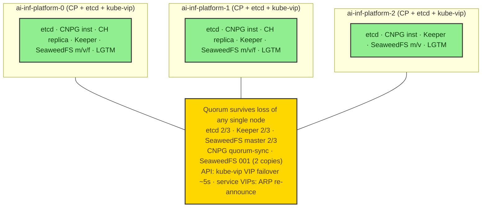
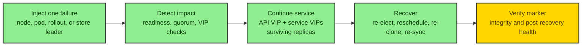

# HA and Reliability

This document is the operator-facing reference for the platform's high-availability
topology, the reliability mechanisms that back it, the deliberate HA exceptions,
the failure-injection scenarios with per-store RPO/RTO, and the recovery runbooks.
It is the companion to spec §6 (HA matrix, stateful reliability, failure injection)
and to [`architecture.md`](architecture.md) (HA and failure domains, D08).

> **Cluster substrate (v7 pivot — D005).** HA is built on upstream **kubeadm**
> Kubernetes with **3 control-plane nodes + stacked etcd**, a **kube-vip**
> control-plane VIP, and **Cilium** in kube-proxy-replacement mode with LB-IPAM /
> L2-announced service VIPs on the shared L2 (`192.168.105.0/24`). The cluster AND
> every host-facing service survive the loss of any **single Lima VM**. The §6.2
> replica/PDB/anti-affinity policy below is unchanged. See
> [`architecture.md`](architecture.md) for topology.

> The platform is HA in *shape* (quorum, anti-affinity, PDBs, rolling updates) but
> the guarantees are **lab-scale**: there is one physical host, so a hardware
> failure of the Mac takes everything down. The HA design protects against
> pod/VM-level disruption within the cluster, not against host loss.

> The inline failure-domain block uses the standard high-contrast `classDef`
> palette shared across this docs set.

## 1. Canonical HA matrix (§6.2)

Resource values are the **minimal-request defaults**: starting points to be
measured and right-sized, escalated (not silently cut) if the cluster cannot fit
them (§6.5). Storage is per-replica unless noted. All anti-affinity is `required`
on `topologyKey: kubernetes.io/hostname` unless stated otherwise. Legend: PDB =
PodDisruptionBudget; probes R = readiness / L = liveness / S = startup.

### 1.1 Control plane and CNI

| Component | Replicas / quorum | PDB | Anti-affinity | Update | CPU req | Mem req | Mem limit | Storage |
|---|---|---|---|---|---|---|---|---|
| kubeadm control plane (`ai-inf-platform-0/1/2`) | **3** control-plane nodes, **stacked-etcd** Raft quorum (tolerates 1 loss) | operational (one node at a time) | one node per Lima VM (1:1) | sequential init/join via VIP, one node at a time (etcd >=2/3) | host VM 4 CPU | 8 GiB VM | — | etcd on node root disk (50 GiB) |
| kube-vip (control-plane VIP) | static pod 1/CP node; **1 active** holder (leader election, lease `plndr-cp-lock`) | N/A (static pod) | per-node | static-pod replace | 50m | 64Mi | 128Mi | none (hostNetwork) |
| Cilium agent | DaemonSet (1/node) | N/A | per-node | RollingUpdate `maxUnavailable: 1` | 100m | 128Mi | 512Mi | none (hostPath bpf) |
| Cilium operator | **2** | `minAvailable: 1` | required, hostname | RollingUpdate `maxUnavailable:1 / maxSurge:1` | 50m | 128Mi | 256Mi | none |
| Cilium LB-IPAM / L2 announcer | per-agent; **leader per service VIP** | N/A | per-node | n/a | (in agent) | (in agent) | (in agent) | none |

### 1.2 Gateway and application plane

| Component | Replicas | PDB | Anti-affinity | Update | CPU req | Mem req | Mem limit | Storage |
|---|---|---|---|---|---|---|---|---|
| LiteLLM | **>=2** | `minAvailable: 1` | required, hostname | RollingUpdate `maxUnavailable:0 / maxSurge:1` | 400m | 1Gi | 8Gi | none (state in `litellm-pg`) |
| Langfuse web | **2** | `minAvailable: 1` | required, hostname | RollingUpdate `maxUnavailable:0 / maxSurge:1` | 200m | 512Mi | 2Gi | none |
| Langfuse worker | **2** | `minAvailable: 1` | required, hostname | RollingUpdate `maxUnavailable:1 / maxSurge:1` | 200m | 512Mi | 2Gi | none |

> LiteLLM requests/limits follow §9.2 (req 400m / 1Gi, lim 1500m / 8Gi — the 8Gi
> ceiling is deliberate: two workers spike past 3Gi and a 4Gi cap OOM'd in the
> POC). Langfuse requests/limits follow §12.1 (req 200m / 512Mi, lim 1500m / 2Gi).

### 1.3 Stateful data stores

| Component | Replicas / quorum | PDB | Anti-affinity | CPU req | Mem req | Mem limit | Storage |
|---|---|---|---|---|---|---|---|
| CNPG `langfuse-pg` | **3** instances, quorum-sync (`method: any`, `number: 1`) | CNPG-managed | required, hostname | 250m | 512Mi | 1Gi | local-path 10Gi/instance |
| CNPG `litellm-pg` | **3** instances, quorum-sync (same) | CNPG-managed | required, hostname | 250m | 512Mi | 1Gi | local-path 10Gi/instance |
| ClickHouse CHI `langfuse-ch` | shards **1** / replicas **2** (ReplicatedMergeTree) | `maxUnavailable: 1` | required, hostname | 500m | 2Gi | 8Gi | local-path 20Gi/replica |
| ClickHouse Keeper (CHK) | **3**, Raft quorum (tolerates 1) | `maxUnavailable: 1` | required, hostname | 100m | 256Mi | 512Mi | local-path 2Gi/replica |
| Valkey | **3** (1 primary + 2 replica), `minReplicasToWrite: 1` | `minAvailable: 2` | required, hostname | 50m | 64Mi | 320Mi | none (persistence off; BullMQ re-enqueue) |
| SeaweedFS master | **3**, Raft quorum (tolerates 1) | `maxUnavailable: 1` | required, hostname | 100m | 256Mi | 512Mi | local-path 2Gi/replica |
| SeaweedFS volume | **3**, node-spread, replication `001` (2 copies) | `minAvailable: 2` | required, hostname | 100m | 256Mi | 1Gi | local-path 10Gi/replica |
| SeaweedFS filer | **2** (embedded S3 :8333) | `minAvailable: 1` | required, hostname | 100m | 256Mi | 1Gi | local-path 5Gi/replica |

### 1.4 Observability (LGTM + collectors)

| Component | Replicas | PDB | Anti-affinity | CPU req | Mem req | Mem limit | Storage |
|---|---|---|---|---|---|---|---|
| Grafana | **2**, CNPG-backed DB + headless (alerting HA peers) | `minAvailable: 1` | required, hostname | 100m | 128Mi | 512Mi | DB in CNPG (no node-pinned SQLite) |
| Loki (SimpleScalable) | read **2** / write **2** / backend **2**, RF **2** | `minAvailable: 1` per target | required, hostname per target | 100m each | 256Mi each | 1Gi each | chunks/index in SeaweedFS S3; small WAL local-path |
| Tempo (single-binary) | **1** (documented HA exception) | N/A (single pod) | n/a | 100m | 512Mi | 3Gi | traces in SeaweedFS S3; WAL local-path |
| Prometheus (standalone) | **2** (StatefulSet, hard anti-affinity), no dedup (exception) | `minAvailable: 1` | required, hostname (hard) | 100m | 512Mi | 2Gi | local-path 10Gi/replica (each replica an independent store) |
| OTel Collector | DaemonSet (1/node) | N/A | per-node | 100m | 256Mi | 1Gi | local-path checkpoint PVC/node |
| Alloy | DaemonSet (1/node) | N/A | per-node | 20m | 64Mi | 256Mi | none |

Matrix notes:

- kubeadm control-plane nodes are host-level Lima VMs, not pods; their "PDB" is
  operational — never `limactl stop` / drain more than one node at a time so
  stacked etcd keeps >=2/3.
- The API endpoint is the **kube-vip VIP** (`192.168.105.40:6443`), not any single
  node IP, so it survives a node loss; with no kube-proxy, Cilium's
  `k8sServiceHost` is also that VIP (see §2.1).
- CNPG and Altinity clusters are operator-managed: PDB/probes/rollout come from the
  operator CR, not hand-authored Deployment fields.
- Loki SimpleScalable is the pragmatic 3-node HA mode (deprecated upstream before
  Loki 4.0; Distributed-on-S3 is the forward path).

## 2. Quorum stores

The platform's durability rests on four quorum/replication mechanisms, each
tolerant of a single-node loss:

- **etcd** — 3 kubeadm control-plane nodes, **stacked** etcd (etcd co-located with
  each apiserver). Quorum is 2/3; sequential bring-up (`ai-inf-platform-0` `kubeadm init`
  first, then `ai-inf-platform-1`/`-2` `kubeadm join --control-plane` via the VIP) is
  required so etcd forms cleanly.
- **CNPG quorum-sync** — `synchronous` `method: any`, `number: 1`: a commit is
  acknowledged only after at least one of the two standbys confirms (RPO ~ 0).
  `number` is kept strictly below `instances - 1` (1 < 2) so a single standby
  outage cannot stall writes.
- **ClickHouse Keeper** — a 3-node Raft ensemble coordinates the 2 ReplicatedMergeTree
  data replicas; the data layer needs only 2 copies because durability/coordination
  is delegated to the 3-node Keeper.
- **SeaweedFS** — master Raft 3 (tolerates 1) holds cluster topology; volume
  replication `001` keeps 2 copies on **different nodes** (anti-affinity makes
  "different server" coincide with "different node"), so a whole-node loss still
  leaves a full copy.

### 2.1 Control-plane HA (kube-vip VIP + stacked etcd, kube-proxy-free)

The control plane survives any single Lima VM loss on three independent legs:

- **API endpoint = the kube-vip VIP.** `192.168.105.40:6443` is ARP-announced on
  `lima0` by a `ghcr.io/kube-vip/kube-vip:v1.2.0` static pod running on each of
  the three control-plane nodes. The pods leader-elect (lease `plndr-cp-lock`,
  5s); exactly one holds the VIP. On loss of the holder, another node wins the
  lease and re-announces the VIP via gratuitous ARP — **failover ~5s**, and the
  kubeconfig `server` / `controlPlaneEndpoint` never changes. kube-vip is
  **control-plane only** (`cp_enable=true`, `svc_enable` omitted); Cilium owns
  service VIPs, so the two never fight over L2.
- **Stacked etcd quorum 2/3.** All three nodes run etcd co-located with their
  apiserver; the Raft ensemble tolerates one member loss. The surviving 2 keep
  quorum and continue serving writes; the returned node rejoins and re-syncs.
- **kube-proxy-free, so Cilium needs the VIP too.** kubeadm runs with
  `--skip-phases=addon/kube-proxy`, so there is no kube-proxy to program the
  `kubernetes` ClusterIP that Cilium agents would otherwise bootstrap against.
  Cilium is therefore told the apiserver out-of-band via `k8sServiceHost:
  192.168.105.40` (the VIP) / `k8sServicePort: 6443`. Pointing this at a single
  node IP would sever every agent from the API on that node's loss — the VIP is
  what makes the kube-proxy-free path HA. `kubeProxyReplacement: true` works in
  both `routingMode: native` (default) and the `tunnel` fallback.

### 2.2 Service HA (Cilium L2-announced LoadBalancer VIPs)

Host-facing services get stable LoadBalancer VIPs from a
`CiliumLoadBalancerIPPool` (`lima-shared-pool`, blocks `192.168.105.200-.250`),
announced by a `CiliumL2AnnouncementPolicy` (`lima-lb-l2`, `interfaces:
['^lima0$']`, control-plane nodeSelector). For each VIP, one node is the L2 leader
and answers ARP; on its loss another node takes over the announcement (gratuitous
ARP re-point), so the VIP keeps serving. Service VIPs and the replica/PDB
mechanics combine as follows:

- VIP assignment is HA (any of the 3 nodes can announce), and the backing pods are
  spread by the §6.2 anti-affinity (one replica per node), so a node loss removes
  at most one backend replica **and** at most one ARP-announcer — neither takes
  the VIP down.
- Services use `externalTrafficPolicy: Cluster` (required: `Local` can blackhole
  on pod-less nodes for an L2-announced IP) so traffic to the VIP is forwarded to
  a Ready backend on any node.
- The VIP-to-service map (LiteLLM `.200`, Langfuse-web `.201`, Grafana `.202`,
  in-cluster OTel OTLP `.203`, Hubble UI `.204`) is the §7 table in
  [`architecture.md`](architecture.md).

### 2.3 Node-pinned host-mount data

Store PVCs land in node-pinned host mounts (`./.local/lima/{vm}/storage` →
`/mnt/lima/storage`, via local-path-provisioner with `WaitForFirstConsumer`). The
mount is **per-node and does not migrate**, so HA for that data comes entirely
from the store's own replication/quorum (CNPG quorum-sync, ClickHouse
ReplicatedMergeTree + Keeper, SeaweedFS `001`, etc.) — not from the mount. On a
node loss the surviving replicas serve; on node return the rejoined store
re-syncs into a fresh host mount (e.g. CNPG re-clones — see §8). The host mount's
only HA role is durability across a **VM rebuild** (the data stays on the Mac
disk), not failover.

## 3. Reliability mechanisms

- **PodDisruptionBudgets** keep each component at or above its floor during
  voluntary disruption (drain/upgrade). A drain blocks rather than violating a PDB.
- **Probes** — readiness gates Service endpoints (so a failed pod is pulled
  without 5xx storms), liveness restarts wedged pods, and generous startup probes
  cover slow first boots (CNPG instance manager, ClickHouse table attach, Langfuse
  migrations, Tempo ~90s WAL replay).
- **Pod anti-affinity / topology spread** on `kubernetes.io/hostname` spreads
  replicas across the three nodes so a node loss removes at most one replica per
  component.
- **RollingUpdate** strategy with per-component surge/`maxUnavailable` keeps at
  least the PDB floor Ready throughout a rollout (LiteLLM/Langfuse/Grafana serve
  continuously).
- **Minimal requests with reasonable limits** — explicit CPU + memory requests on
  every container make the scheduler's fit calculation real; limits are bounded
  headroom so one component cannot OOM a node.

## 4. Documented HA exceptions

Where production-grade HA is deliberately simplified for the laptop sizing budget,
the deviation is recorded inline in the manifests and here — never a surprise.

| Exception | Why simplified | Production alternative | Escalation path |
|---|---|---|---|
| **Tempo single-binary** (1 replica) | The monolithic Tempo chart is not built for clean multi-replica scaling; `tempo-distributed` runs 6 component pods — too many for fixed 4/8/50 sizing | `tempo-distributed` (minimal 2x per component) on the same SeaweedFS S3 backend | §6.5 sizing bump approval, then migrate on the same S3 backend (chart 2.25.4 is pre-pinned) |
| **Prometheus 2 replicas, no dedup** | Thanos/Mimir are out of scope, so the two replicas hold independent (not merged) series; a query hits whichever replica the Service routes to | Thanos or Mimir for cross-replica dedup/merge | Out of v7 scope; documented, not worked around |
| **Valkey persistence off** | BullMQ re-enqueues pending jobs on reconnect, so a restart costs at most in-flight job re-processing | AOF/RDB persistence if durable queue state is required | Enable persistence; standalone (1 pod) is the defensible fallback under sizing pressure precisely because the data is intentionally non-durable |

Tempo mitigations make the single-binary exception safe: (1) traces live in
SeaweedFS S3, so data survives a node loss even though the pod does not — on
reschedule Tempo re-attaches to the same S3 backend (RPO 0 for flushed blocks);
(2) `readinessProbe.initialDelaySeconds: 90` covers the ~90s WAL replay so the pod
is not declared Ready before replay completes; (3) a `preStop: sleep 5` drains
endpoints before SIGTERM so in-flight OTLP pushes are not dropped.

## 5. Failure-domain view

Representative failure-domain placement (one replica per node tolerates one loss):

## 6. Failure-injection scenarios

The platform is validated against a defined set of injections, not assumed HA.
Each follows the same protocol and is driven via `kubectl` against the live 3-node
cluster, with endpoint checks made **directly against the service VIPs** on the
shared L2 (`192.168.105.200-.204`) and the API VIP (`192.168.105.40:6443`) — that
is what proves the HA path, since port-forward cannot follow a VIP failover and
would mask a node-loss outage. Run via `mise run smoke:ha` (and the focused tasks
`smoke:ha:node-loss`, `smoke:ha:pod-loss`, `smoke:ha:data-integrity`,
`smoke:ha:recovery`).

**Universal protocol:** (1) pre-failure write a uniquely-tagged marker through the
component; (2) inject the failure; (3) observe continuity (HA endpoints keep
serving, readiness pulls the failed pod without 5xx storms); (4) recover (replicas
/ quorum return, anti-affinity re-spreads, PDBs satisfied); (5) post-recovery
re-read the marker and verify per-store integrity.

| Scenario | Injection | Expectation |
|---|---|---|
| **Node loss (hard)** | `limactl stop ai-inf-platform-<n>` (one VM) | etcd keeps quorum (2/3); if the lost node held the **kube-vip VIP**, another node re-elects + re-announces it (~5s) so the API stays reachable at `192.168.105.40:6443`; Cilium **re-announces every affected service VIP** from a surviving node; pods reschedule to survivors; every HA component keeps serving; no quorum service loses quorum |
| **Node restart (graceful drain)** | `kubectl drain <node> --ignore-daemonsets --delete-emptydir-data`, reboot | PDBs prevent dropping any component below floor; drain blocks (not forces) on PDB violation; VIP/announcer leadership moves off the drained node; replicas re-spread after uncordon |
| **Pod delete** | `kubectl delete pod` on one replica of each HA component | controller/operator recreates it; readiness keeps endpoints correct; no client-visible failure for 2-replica services |
| **Rollout restart** | `kubectl rollout restart` per Deployment/StatefulSet | surge/`maxUnavailable` keep at least the PDB floor Ready; LiteLLM/Langfuse/Grafana serve continuously |
| **Data-store failover** | kill the CURRENT primary/leader (CNPG primary, a CH replica + a Keeper member, SeaweedFS master leader, Valkey primary) | automatic promotion/election (tens of seconds); writes resume; no acknowledged write lost |
| **API-endpoint failover** | stop the node currently holding the kube-vip VIP | kube-vip re-elects a new leader and re-announces `192.168.105.40` (~5s); `kubectl` against the VIP recovers without a kubeconfig change |
| **Endpoint continuity** | steady low-rate client against the **service VIPs** throughout each scenario | transient failover blips allowed (VIP ARP re-point); a sustained HA-component or VIP outage is a test failure |

## 7. Per-store RPO / RTO

| Store | RPO | RTO | Integrity rule |
|---|---|---|---|
| CNPG Postgres (`langfuse-pg`, `litellm-pg`) | **0** for acknowledged writes (quorum-sync) | promotion time (tens of seconds) | every pre- and during-failure committed row present on the new primary; no phantom/lost commits |
| ClickHouse + Keeper | **0** for inserted parts once replicated | replica rejoin + re-sync | surviving replica has all parts; returned replica re-syncs identical part sets via Keeper; Keeper quorum (2/3) preserved |
| Valkey | in-flight BullMQ jobs only (persistence off, by design) | reconnect | queue continues; pending jobs re-enqueued by BullMQ; no authoritative state lost |
| SeaweedFS | **0** for committed chunks (`001`, 2 copies on distinct nodes) | node return + replication re-fill | every pre-failure PUT readable from the surviving copy; master quorum (2/3) preserved |
| Loki | no loss of flushed chunks (RF 2 + S3) | brief ingest gap during write-pod failover | logs written before/during failure remain queryable |
| Tempo | **0** for flushed blocks (S3); at-risk window = in-WAL during ~90s replay | reschedule + ~90s WAL replay | flushed trace blocks survive the single-pod reschedule; OTel Collector retry/buffer covers the gap (documented exception) |
| Prometheus | each replica independent; pre-failure series on the lost replica's PVC unavailable until node returns (no dedup) | node return | surviving replica has continuous data going forward (acceptable for a lab) |

Recovery acceptance for all scenarios: within a bounded window (target: data
stores re-quorum and stateless services re-spread within a few minutes of node
return), `kubectl get pods` shows all replicas Ready, PDBs satisfied,
anti-affinity respected, and the post-recovery consistency check passes.

## 8. Recovery runbooks

- **kube-vip / service-VIP failover.** No manual step on a node loss: kube-vip
  re-elects (lease `plndr-cp-lock`) and re-ARPs the API VIP within ~5s, and Cilium
  re-announces each affected service VIP from a surviving node. To confirm
  recovery, `kubectl --server https://192.168.105.40:6443 get nodes` succeeds and
  `curl` to each service VIP (`.200-.204`) returns; `cilium status` and
  `kubectl -n kube-system get ciliuml2announcementpolicy` show announcers healthy.
  If the API VIP is unreachable after a node returns, check that the kube-vip
  static pod is present on each control-plane node (`/etc/kubernetes/manifests/`)
  and resolving `super-admin.conf` vs `admin.conf` correctly (see
  [`troubleshooting.md`](troubleshooting.md)).
- **CNPG re-clone.** On primary loss, CNPG promotes a healthy standby automatically
  (RTO = promotion + DNS re-point). When a pod reschedules to a new node, its
  node-pinned `local-path` PVC is gone, so CNPG **re-clones** the instance from the
  primary; 3 instances guarantee a re-clone never races against the only surviving
  copy. Confirm `cnpg status` shows 3 healthy instances and quorum-sync restored.
- **ClickHouse / Keeper quorum.** A lost replica + (if co-located) one Keeper vote
  are both tolerated (2/3). When the replica returns, ReplicatedMergeTree re-syncs
  missing parts from its peer via Keeper. Confirm both replicas report identical
  part sets and Keeper reports a healthy 3-member quorum.
- **SeaweedFS node loss.** Objects remain readable from the surviving copy
  (replication `001`). On node return, SeaweedFS replication re-fills the missing
  copy; confirm master quorum (2/3) and that volume servers report 2 copies per
  chunk again.
- **Valkey re-enqueue.** After a primary failover, the queue continues and BullMQ
  re-enqueues pending jobs on reconnect — there is no durable Valkey state to
  restore. Confirm the Langfuse worker drains the queue.
- **LiteLLM key recovery.** Virtual keys are minted by an **idempotent** Job
  (GET-then-PATCH-or-POST). On a CNPG re-bootstrap that wipes the LiteLLM DB,
  re-run the key-mint Job; it regenerates fresh plaintexts which the operator
  re-seals into fnox (see [`secrets.md`](secrets.md)).

### 8.1 Backup and restore drill backlog

The current manifests document HA failover and re-clone behavior, not proven
backup/restore. Do not claim production-like durability until these drills are
implemented, run on a fresh cluster, and recorded with restore evidence.

- **CNPG PITR drill.** Enable each commented `backup.barmanObjectStore` block only
  after creating dedicated SeaweedFS backup buckets and secret wiring. Create a
  `Backup` object for `litellm-pg` and `langfuse-pg`, verify WAL/archive upload,
  restore each into a scratch CNPG cluster, and compare known rows, schema version,
  and application readiness against the source. Record the exact recovery target
  time and whether cutover is manual or automated.
- **ClickHouse backup drill.** Add a dedicated `clickhouse-backups` bucket and
  credentials, then run a scoped `BACKUP DATABASE default TO S3(...)` from the
  Langfuse ClickHouse cluster after writing a uniquely tagged trace/event marker.
  Restore into a scratch database or scratch CHI, compare row counts and replicated
  part metadata, and verify Keeper remains healthy. Do not treat ReplicatedMergeTree
  peer re-sync as a substitute for object-store backup.
- **Acceptance gate.** Extend `smoke:ha` or add a focused drill task only after
  the above paths are repeatable without secrets in logs. Until then, CNPG backup
  and ClickHouse restore are explicit production upgrade backlog items.

## 9. Resource sizing and escalation

The Lima/kubeadm node sizing is **fixed at 4 CPU / 8 GiB / 50 GiB per node** (three
control-plane nodes) as the default — the budget the entire HA stack must fit
before any change is proposed. The mandatory first response to capacity pressure is to **minimize
requests** (set them to what a component needs to schedule and start, measure under
the smoke workload, right-size down) — never silently drop a replica, drop a
quorum member, or disable a component.

If, after minimizing, the full HA topology still cannot schedule on
3 x (4 CPU / 8 GiB / 50 GiB), the resolution is the **§7.2 escalation policy**, in
order: (1) the implementer reports the concrete shortfall (which components are
`Pending`, summed requests vs. budget, the minimal requests already applied) to the
lead; (2) the lead surfaces it to the user as a decision with two framed options —
(a) approve a sizing bump, or (b) approve a documented, named HA reduction for a
specific component. ClickHouse (Keeper quorum 3 + CHI replicas 2) is the heaviest
component and the first candidate for escalation.

## Related docs

- [`architecture.md`](architecture.md) — planes, topology, and HA/failure domains.
- [`observability-taxonomy.md`](observability-taxonomy.md) — the signal stores backed by SeaweedFS S3.
- [`troubleshooting.md`](troubleshooting.md) — bring-up ordering and recovery gotchas.
- [`developer-workflows.md`](developer-workflows.md) — the `smoke:ha` task surface.
- [`kubernetes/README.md`](../kubernetes/README.md) — apply order.
