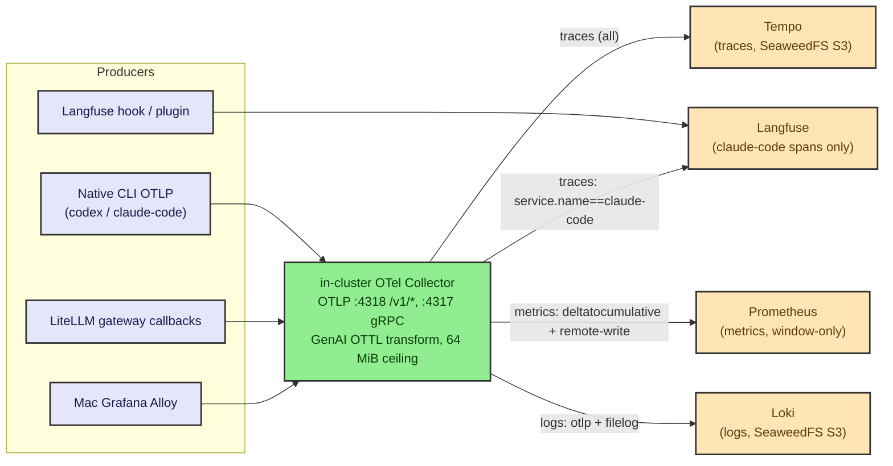
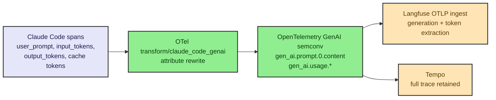

# Observability Taxonomy

This is the canonical reference for telemetry **identity** and **signal
organization** in the ai-infra-platform lab: the resource attributes that
identify every signal, where each signal is routed, the GenAI OTTL transform, the
OTLP endpoints, the cardinality rules, the full-capture posture and its privacy
caveat, and the Grafana dashboard inventory. It is the companion to spec §13 and
to [`architecture.md`](architecture.md) (telemetry data flow, D14).

> Representative diagrams below use the standard high-contrast `classDef` palette
> shared across this docs set.

## 1. Identity taxonomy

A **single canonical attribute set** is emitted by every producer and mapped to
each backend's native shape. The platform standardizes on OpenTelemetry semantic
conventions everywhere; the source's ad-hoc `env` attribute and `workstation_`
metric-name prefix are retired.

| Canonical attribute | Value examples | Langfuse | Loki | Tempo | Prometheus |
|---|---|---|---|---|---|
| `deployment.environment` | `ai-infra-platform-local` | trace.environment | metadata | resource | label |
| `host.id` / `host.name` | `mac-local` / host name | metadata | label | resource | label |
| `ai.client.name` | `codex`, `claude-code`, `smoke-test` | tag + metadata | metadata | resource | label |
| `session.id` | UUID | `session_id` | `conversation_id` | `conversation.id` / `thread.id` | (n/a) |
| `gen_ai.request.model` / `model` | model id | observation.model | metadata | attr | label |
| `litellm.key_alias` / `litellm.team` | `claude-code` / `agents` | default_tags | — | attr | label |
| `vcs.repository.name` / `vcs.ref.head.name` (+ enriched `vcs.*` set, §1.1) | `ai-infra-platform` / `feat/upgrade-sweep-max-capture` | tags + metadata | metadata | resource | label |

Standard values and rules:

- **`deployment.environment = ai-infra-platform-local`** on every producer. This
  replaces the source's inconsistent split (the bare `env` /
  `environment=local-dev` from the CLIs, and `deployment.environment=dev` from
  in-cluster agents). The bare `env` attribute is **retired**.
- **`host.id = mac-local`** (placeholder) with `host.name` carrying the actual
  host name as a low-cardinality label. The source's `workstation_`-prefixed
  macmon metric names baked host identity into the metric name — an anti-pattern;
  v7 moves host identity onto a **`host.name` label** so the stack generalizes to
  multiple hosts.
- **`ai.client.name in {codex, claude-code, smoke-test}`** — an explicit resource
  attribute giving every surface one queryable client dimension (the source
  encoded this only implicitly via `service.name`).
- **`session.id`** — the **universal join key** (a UUID). Clients send it via the
  `X-Claude-Code-Session-Id` header (or the client-neutral `X-Session-Id`);
  LiteLLM reads it through `langfuse_session_id_header` to unify the gateway trace
  with the CLI's hook/plugin trace under one Langfuse Session.
- **LiteLLM key/team aliases.** `langfuse_default_tags` stamps every gateway trace
  with `user_api_key_alias`, `user_api_key_team_alias`, `user_api_key_user_email`,
  `model_group`, `cache_hit`, and `proxy_base_url`. The v1 consumer key aliases
  are `codex`, `claude-code`, and `smoke-test`; the team alias is `agents`.
- **Gateway Langfuse callback = classic `langfuse`.** The gateway logs traces via the
  classic `langfuse` success/failure callback (`proxy-config.yaml`
  `success_callback: ["langfuse"]`), **not** `langfuse_otel`. The OTLP callback was
  trialed end-to-end and **reverted**: it dropped per-generation TTFT
  (`completion_start_time`) and the `langfuse_default_tags` above — both LiteLLM
  classic-path-only — while **not** fixing codex output. Codex `/responses` streaming
  output is empty at the LiteLLM source (a `BaseResponsesAPIStreamingIterator` bug) and
  is reconstructed by the **§8d** sitecustomize before any sink reads it, so it lands in
  spend-logs, s3_v2, and the classic Langfuse trace alike; see
  [`developer-workflows.md`](developer-workflows.md) §6.2.
- **`vcs.*` — dynamic git context (OpenTelemetry VCS semantic conventions, RC).**
  Appended to `OTEL_RESOURCE_ATTRIBUTES` at shell-init by a mise `{{exec()}}`:
  `vcs.repository.name` (origin-remote slug → git-toplevel-dir basename → `unknown`),
  `vcs.repository.url.full` (the origin remote URL, omitted with no remote),
  `vcs.owner.name` (parsed from the remote, omitted if unresolvable),
  `vcs.provider.name=github`, `vcs.ref.head.name` (`git branch --show-current` →
  `detached`), `vcs.ref.head.type=branch`, and `vcs.ref.head.revision` (`git rev-parse
  HEAD`, omitted with no commit) — so every metric/log/trace a CLI emits is tagged with
  the repo, branch, owner, and commit it ran on. Empty-valued optional fields are
  dropped, never emitted as `key=`. The example values above are the **origin-remote
  slug** (resolved first) and the current branch; the git-toplevel-dir basename
  (`ai-infra-platform-claude` on this clone) is only the repository-name fallback.
  Attribute names follow the OpenTelemetry VCS semantic conventions (RC):
  **`vcs.ref.head.name`** is the single canonical branch key — it replaces the earlier
  ad-hoc `vcs.branch.name` — and the §1.1 correlation triplet's PR attribute is now
  **`vcs.change.id`** (was `vcs.pr.number`). Git context is new (no dashboards yet), so
  the rename is a clean swap with nothing to migrate. `vcs.ref.head.name` is shared
  across these resource attrs **and** the §1.1 correlation records, so one selector
  matches both. `OTEL_METRICS_INCLUDE_RESOURCE_ATTRIBUTES=true` carries them onto Claude
  Code metrics as Prometheus labels.
- **Gateway-side tag promotion — `x-litellm-tags` alongside
  `x-litellm-spend-logs-metadata`.** The same repo/branch pair is stamped as **LiteLLM
  spend-log metadata** via the `x-litellm-spend-logs-metadata` header (a JSON blob:
  `source`/`host`/`repo`/`branch`, composed in `ANTHROPIC_CUSTOM_HEADERS` for Claude, the
  `.config/bin/codex` wrapper for Codex). A second header, **`x-litellm-tags`**, now
  rides alongside it — a comma-separated `vcs.<key>:<value>` list (`vcs.repository.name`,
  `vcs.owner.name`, `vcs.provider.name`, `vcs.ref.head.name`, `vcs.ref.head.type`,
  `vcs.ref.head.revision`) built the same way by both CLIs. `x-litellm-tags` is a
  **LiteLLM-native header**: the gateway auto-promotes it directly into both the
  spend-log `tags` array and the classic-callback Langfuse trace's tags, with no
  `extra_spend_tag_headers` metadata-blob indirection required — so gateway spend logs
  **and** Langfuse traces now pivot by repository, owner, branch, and commit, not just
  repo/branch. Both CLIs honor the single `OTEL_RESOURCE_ATTRIBUTES` var for the resource
  attrs above.

### 1.1 Dynamic git-context correlation (branch / PR events)

Beyond the static `vcs.*` resource attributes, a **`PostToolUse` `Bash` hook**
(`.config/hooks/otel-git-context.*`, wired in Claude `settings.json` and the codex hook
config) detects `git checkout -b` / `git switch -c` / `gh pr create`, parses the new
branch, PR number, and (for `gh pr create --title`) PR title, and emits a **correlation
triplet — one span, one `agent.git.event` counter metric, and one log** — each carrying
`session.id` plus the enriched OpenTelemetry VCS semantic-conventions (RC) set:
`vcs.repository.name`, `vcs.repository.url.full`, `vcs.owner.name`, `vcs.provider.name`
(`github`), `vcs.ref.head.name`, `vcs.ref.head.type` (`branch`), `vcs.ref.head.revision`,
`vcs.change.id`, plus `event` and `agent` — with a `pr_created` record additionally
carrying `vcs.change.title` and `vcs.change.state` (`open`; the hook only emits the
creation event, so `state` is always `open`). `vcs.ref.head.name` rides under the
**same canonical key** as the §1 resource attrs (replacing the earlier `vcs.branch.name`),
and `vcs.change.id` replaces the earlier `vcs.pr.number`, so a single selector matches
both signal families. Empty/unset fields are dropped from every record, never emitted
with no value. Records post to the OTel Collector at `http://$AI_INFRA_OTEL_VIP:4318`
(the VIP is used because Claude strips inherited `OTEL_*` env from hooks). Because a hook
cannot mutate an already-running span, the design **appends** correlation records rather
than rewriting session spans:

- **Claude** — the hook inherits `TRACEPARENT` (`CLAUDE_CODE_PROPAGATE_TRACEPARENT=1`),
  so its span joins the live session trace as a **child**; tagged
  `service.name=claude-code`, it also reaches Langfuse.
- **Codex** — hooks do **not** receive traceparent, so codex emits a **root correlation
  trace keyed by `session.id`** that pivots back to the gateway trace by the universal
  join key.

Net: every branch cut and PR opened during a run is queryable — **appended, never
overwriting** — and joined back to the session by `session.id`.

**Auto-promoted Langfuse tags (native-CLI trace path).** A collector-side OTTL
transform on the `traces/langfuse` pipeline (§2 — the same fan-out that already runs
`transform/claude_code_genai` + `filter/langfuse_only_claude_code`) copies the
resource-level `vcs.*` attributes onto `langfuse.trace.tags`, the attribute key
Langfuse's OTLP ingest reads to auto-populate a trace's tag list. This is the
**native-CLI-OTLP counterpart** to the gateway-side `x-litellm-tags` promotion in §1:
the LiteLLM classic-callback trace gets its tags from `x-litellm-tags`, while the CLI's
own OTLP span (fanned to Langfuse per §2) gets them from this OTTL copy. The repo/owner/
branch/revision tags — `vcs.repository.name` / `vcs.owner.name` / `vcs.ref.head.name` /
`vcs.ref.head.revision` — appear as filterable Langfuse tags on **both** trace shapes;
`vcs.change.id` (and `vcs.change.title` / `vcs.change.state`) appear **only** on the
native-CLI OTLP shape via this collector transform, because the `x-litellm-tags` header is
composed once at CLI launch (before any PR exists) and so can never carry the PR number.
No manual `langfuse_default_tags` entry is required for either.

## 2. Signal routing (per backend)

Representative signal routing (matches D14 in [`architecture.md`](architecture.md)):

- **Traces -> Tempo.** Every trace goes to Tempo in full
  (`otlphttp/tempo` -> `tempo.lgtm.svc.cluster.local:4318`).
- **Langfuse-only fan-out.** A parallel `traces/langfuse` pipeline applies
  `filter/langfuse_only_claude_code` and fans **only** `service.name ==
  "claude-code"` spans to Langfuse's OTLP endpoint
  (`langfuse-web.langfuse.svc.cluster.local:3000/api/public/otel`). All traces
  still reach Tempo via the primary `traces` pipeline.
- **Metrics -> Prometheus** via remote-write to
  `prometheus-server.lgtm.svc.cluster.local/prometheus/api/v1/write`. Codex emits
  **delta**-temporality metrics, so the `deltatocumulative` processor converts to
  cumulative before remote-write (Prometheus needs cumulative).
  `resource_to_telemetry_conversion.enabled: true` turns `host.name` /
  `service.name` / `ai.client.name` into Prometheus labels.
- **Logs -> Loki** via the OTel Collector's OTLP and `filelog` pipelines
  (`otlphttp/loki` -> `loki.lgtm.svc.cluster.local:3100/otlp`). The `filelog`
  receiver is the **general container-log path**; Alloy is meta-observability
  only (it ships the OTel Collector's own pod logs to Loki).

### 2.1 The 64 MiB uniform pipeline ceiling

All OTLP intake caps are raised from the ~4 MiB defaults to a uniform **64 MiB**
(`67108864` bytes), measured against a ~1.3 MB peak single-record size (~40x
headroom). Because full capture records raw bodies, large records are normal and
the default would silently drop them. The ceiling is uniform across the chain and
MUST be changed together and re-verified end-to-end (OTel -> Loki -> Tempo) if
touched:

| Stage | Setting |
|---|---|
| OTel Collector | gRPC `max_recv_msg_size_mib: 64`; HTTP `max_request_body_size: 67108864` |
| Loki | `max_line_size: 64MB` (`max_line_size_truncate: true`); `grpc_server_max_recv/send_msg_size: 67108864`; `ingestion_rate_mb: 32`; `ingestion_burst_size_mb: 64` |
| Tempo | `overrides.defaults.global.max_bytes_per_trace: 67108864` |

The host-side Claude Code **inline-attribute** caps match the same ceiling:
`CLAUDE_CODE_OTEL_CONTENT_MAX_LENGTH=67108864` (raising the 60 KB per-body OTLP content
default) and the langfuse-plugin `CC_LANGFUSE_MAX_CHARS=67108864` — so the
**inline-attribute ceiling is a uniform 64 MiB from client capture through server
intake**. Loki additionally sets `max_line_size_truncate: true`: measured history has
lines up to ~10.8 MiB and none has ever been dropped at 64 MB, but if a line ever does
exceed the ceiling it is truncated (kept + shipped) rather than dropped outright.

### 2.2 Batch-queue anti-drop (shared client SDK)

The OTel SDK's default batch queue holds only **2048** records and **silently drops**
anything beyond it under a burst — exactly what a high-fan-out agent run produces. Both
CLIs raise the shared queues to **16384** (`OTEL_BSP_MAX_QUEUE_SIZE` for spans,
`OTEL_BLRP_MAX_QUEUE_SIZE` for log records; export batch `2048`) so a burst of
spans/logs is buffered rather than dropped before export. This is the biggest "stop
losing events" lever and — unlike the Claude-only `CLAUDE_CODE_*` knobs — is honored by
**both** claude and codex through the shared OTel SDK. The export-cadence and
attribute-count pins that round out the client posture are catalogued in
[`.claude/CLAUDE-RATE-LIMITING.md`](../.claude/CLAUDE-RATE-LIMITING.md).

## 3. The GenAI OTTL transform (keystone)

The `transform/claude_code_genai` processor rewrites Claude Code's proprietary
span attributes into OpenTelemetry GenAI semantic conventions so Langfuse
auto-extracts prompts, completions, and token usage. This is a **keystone**
feature and MUST be preserved — without it, Langfuse receives spans it cannot
decode into generations and token costs.

| Claude Code attribute | -> OpenTelemetry GenAI semconv |
|---|---|
| `user_prompt` | `gen_ai.prompt.0.content` |
| `input_tokens` | `gen_ai.usage.input_tokens` |
| `output_tokens` | `gen_ai.usage.output_tokens` |
| `cache_read_tokens` | `gen_ai.usage.cache_read_tokens` |
| `cache_creation_tokens` | `gen_ai.usage.cache_creation_tokens` |

## 4. OTLP endpoints

The platform standardizes on plain **`:4318`** with the standard
`/v1/{traces,metrics,logs}` paths. The source's `/otel/v1/*` prefix was an
artifact of an overlay-VPN Ingress and is **dropped**. v7 exposes the OTel
Collector as a Cilium LoadBalancer **service VIP** on the shared L2, so host
clients post to `http://192.168.105.203:4318/v1/*` directly (the `port-forward:otel`
port-forward to `http://127.0.0.1:34318/v1/*` is the non-HA fallback), and the
in-cluster Service DNS also serves `/v1/*`. gRPC **`:4317`** is shared on the same
`.203` VIP for in-cluster producers.

| Endpoint | Address | Path | Scope |
|---|---|---|---|
| OTLP / HTTP | `192.168.105.203:4318` (service VIP; `127.0.0.1:34318` via `port-forward:otel` fallback) / `otel-collector.lgtm.svc.cluster.local:4318` | `/v1/{traces,metrics,logs}` | host + in-cluster |
| OTLP / gRPC | `192.168.105.203:4317` (service VIP) / `otel-collector.lgtm.svc.cluster.local:4317` | n/a | host + in-cluster |

## 5. High-cardinality rule

Cardinality discipline governs what becomes a label vs an attribute:

- **Low-cardinality dimensions** (`deployment.environment`, `host.name`,
  `ai.client.name`, `model`, `litellm.key_alias`, `litellm.team`) become
  **labels**.
- **High-cardinality dimensions** (`session.id`, trace/span ids, full prompt
  content) become **attributes / structured metadata / trace fields**, NEVER
  Prometheus labels — a `session.id` label would explode Prometheus series
  cardinality.

**Prometheus is window-only.** Native metrics carry no per-session label
(`session.id` is deliberately not a Prometheus label), so Prometheus can confirm
a *time window* — request rates, token throughput, hardware load, error counts
during a session's wall-clock span — but never isolate a single session.

## 6. Cross-system drilldown: Langfuse -> Loki -> Tempo

A single user turn lands in up to four places — Langfuse (rich generation trace),
Loki (structured logs), Tempo (full distributed trace), and Prometheus (aggregate
metrics) — and `session.id` ties them together:

1. **Start in Langfuse** (the agent-level view: prompts, completions, token
   costs) using `session_id`.
2. **Pivot to Loki** with the same UUID as `conversation_id` to read structured
   logs; Loki structured metadata carries `trace_id`.
3. **Pivot to Tempo** by `trace_id` (TraceQL search by `.conversation.id` proved
   unreliable; lookup by `trace_id` or `resource.service.name` is the reliable
   path).

The Tempo datasource is pre-wired with `tracesToLogsV2` and `tracesToMetrics`
correlations (Tempo UID `P214B5B846CF3925F`, Loki UID `P8E80F9AEF21F6940`,
Prometheus UID `PBFA97CFB590B2093`), so the Tempo <-> Loki <-> metrics pivots are
one click in Grafana. **Prometheus answers "what was the system doing during this
window"**, not "what happened in this session" — session-level drilldown is
exclusively the Langfuse -> Loki -> Tempo path. Host telemetry joins by
`host.name` / `source` from the Mac-side collector.

## 7. Full-capture posture and privacy caveat

Full capture is an intentional v1 design decision: the lab records the complete
content of agent activity — user prompts, tool details and content, and raw
request/response bodies — with **no redaction**. This is what makes the lab
useful for debugging agent behavior and reconstructing exactly what an LLM saw.

**Hard rule — never log secrets.** Full capture applies to prompts, tool I/O, and
model request/response bodies. It MUST NOT capture authentication material:
`Authorization` headers, `x-litellm-api-key`, OAuth tokens, provider API keys, or
store passwords. Telemetry pipelines never copy these into spans, logs, or
metrics.

**Extended thinking capture.** Claude Code's raw-body logger writes model thinking as
`<REDACTED>` — that redaction is unconditional and has no toggle, and it is not the
primary thinking-capture path. Interactive sessions (`cc_entrypoint=cli`) default to
`thinking.display="summarized"` and capture a summary out of the box, but headless/`-p`
sessions (`cc_entrypoint=sdk-cli` — every workflow subagent) default to
`display="omitted"`: the model still reasons, but returns no summary text, so nothing
lands in transcripts, spend-logs, or Langfuse. `CLAUDE_CODE_EXTRA_BODY` (a JSON object
merged into every API request body; covers background/`claude agents`/`--bg` sessions
too on Claude Code ≥ v2.1.206) forces `display="summarized"` for **all** session types —
set project-wide in `conf.d/10-env.toml` — so headless and background sessions now
capture thinking summaries the same as interactive ones. The full summarized thinking
lands **unredacted** in the on-disk session transcripts (`~/.claude/projects/**/*.jsonl`),
which is where thinking is searchable; the raw-body logs still redact it by design.
**Raw, unsummarized** chain-of-thought is provider-gated to the pre-adaptive-thinking
model line: `claude-opus-4-6` and `claude-haiku-4-5` honor the classic fixed
`type:"enabled"` config and return the full raw CoT; the always-adaptive models (the
default `claude-opus-4-8`, `claude-sonnet-5`, `claude-fable-5`) ignore `type:"enabled"`
and only ever expose a summary. A verified per-model preset library lives at
`.config/claude/thinking/` (one JSON file per valid `(model, config)` pair); see
[`.claude/CLAUDE-RATE-LIMITING.md`](../.claude/CLAUDE-RATE-LIMITING.md) for the full
matrix and wiring.

**Privacy caveat (local-lab-only).** Because full capture records whatever the
user typed or pasted, and raw-body capture writes bodies to disk, this posture is
safe only because every backend (Langfuse, Loki, Tempo, Prometheus, Grafana) is
reachable **only on the private Lima L2** (`192.168.105.0/24` — the Mac and the
three VMs, no anonymous access, no external Ingress); the service VIPs are not
routable beyond that host-local subnet. The
documentation states plainly: (1) raw-body capture is a privacy choice —
operators who paste sensitive third-party content should disable or scope it; (2)
the on-disk raw-body directory and the Langfuse / Loki transcript state are
gitignored and never published; (3) the platform makes **no PII-redaction
guarantee in v1** — it is an explicit non-goal.

## 8. Dashboards inventory

Grafana provisions dashboards via two loaders: gnetId chart downloads (pinned
revisions) and a ConfigMap sidecar (`grafana_dashboard=1`,
`searchNamespace: lgtm`, sideloaded JSON). The in-scope set surfaces this taxonomy:

| Dashboard | Source | Surfaces |
|---|---|---|
| k8s-views global / namespaces / nodes / pods | gnetId 15757-15760 | cluster health |
| node-exporter-full | gnetId 1860 | cluster health |
| coredns | gnetId 15762 | networking |
| cilium-agent / cilium-operator / cilium-hubble | gnetId 16611 / 16613 / 16612 | Cilium + Hubble |
| prometheus-overview | gnetId 19268 | LGTM self-monitoring |
| otel-collector | gnetId 15983 | OTel health |
| loki-metrics / logs-by-service / tempo-* | sideloaded forks/mixins | LGTM self-monitoring + logs view |
| litellm | gnetId 24965 (Prometheus variant) | LiteLLM |
| claude-code | sideloaded (hand-rolled, `$model` var) | Claude Code |
| macmon-workstation | sideloaded (hand-rolled) | macmon host telemetry |
| cnpg-postgres | sideloaded (hand-rolled) | CNPG (langfuse-pg + litellm-pg) |
| clickhouse-langfuse | sideloaded (hand-rolled) | ClickHouse store |
| seaweedfs | sideloaded (hand-rolled) | SeaweedFS store |

**Dropped (out of scope), so readers understand the curated set:** all
vector-database dashboards (the Weaviate, Milvus, Qdrant, and pgvector-oriented
`postgres-database` / `postgres-exporter` forks — CNPG is covered by
`cnpg-postgres`), and the entire overlay-VPN dashboard section (no such network
in v7; access is via private-L2 service VIPs, with port-forward as a fallback).
Dashboard defaults: time = `now-24h`, refresh = `1m`.

**Grafana gotchas readers will hit** (see [`troubleshooting.md`](troubleshooting.md)):

- The **Prometheus datasource URL must include `/prometheus`** — the server runs
  with `--web.route-prefix=/prometheus`, so the query API lives under
  `/prometheus/api/v1/*`; omitting the suffix 404s every panel ("No data").
- **Sideloaded dashboards bake datasource UIDs** — any stale `"uid":"Prometheus"`
  / `DS_*` placeholders must be jq-rewritten to the real UIDs (e.g. Prometheus
  `PBFA97CFB590B2093`) before sideloading.
- Some panels are **"No data" until the relevant traffic flows** — e.g.
  cilium-hubble L7 panels populate only once L7 traffic exists; the k8s-views
  pods panel needs the kubelet `/metrics/resource` scrape.

## 9. Retention

Uniform **7 days** across all three signal stores (fits the local PVC / S3 budget
on one Mac; the production 90-day target is out of scope):

| Component | Setting | Value |
|---|---|---|
| Loki | `limits_config.retention_period` (+ compactor `retention_enabled: true`) | 168h (7d) |
| Tempo | `retention` (compactor `compaction.block_retention`) | 168h (7d) |
| Prometheus | `server.retention` | 7d |

## Related docs

- [`architecture.md`](architecture.md) — telemetry data flow and the OTel Collector vs Alloy division (D14).
- [`ha-and-reliability.md`](ha-and-reliability.md) — store HA underpinning observability durability.
- [`troubleshooting.md`](troubleshooting.md) — Grafana "No data", OTLP path, and route-prefix gotchas.
- [`demo-walkthrough.md`](demo-walkthrough.md) — the `session.id` correlation walkthrough end to end.
- [`README.md`](../README.md) — project landing page.
