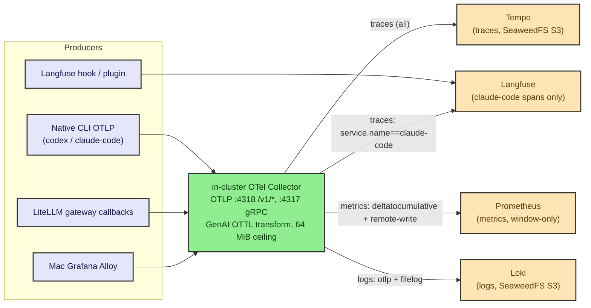
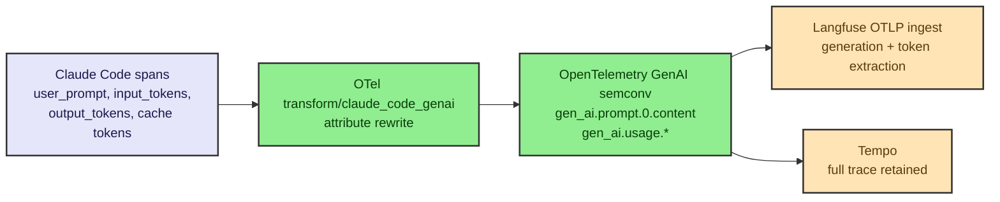

# Observability Taxonomy

This is the canonical reference for telemetry **identity** and **signal
organization** in the ai-infra-platform lab: the resource attributes that
identify every signal, where each signal is routed, the GenAI OTTL transform, the
OTLP endpoints, the cardinality rules, the full-capture posture and its privacy
caveat, and the Grafana dashboard inventory. It is the companion to spec §13 and
to [`architecture.md`](architecture.md) (telemetry data flow, D14).

> Representative diagrams below use the standard high-contrast `classDef` palette
> shared across this docs set.

## 1. Identity taxonomy

A **single canonical attribute set** is emitted by every producer and mapped to
each backend's native shape. The platform standardizes on OpenTelemetry semantic
conventions everywhere; the source's ad-hoc `env` attribute and `workstation_`
metric-name prefix are retired.

| Canonical attribute | Value examples | Langfuse | Loki | Tempo | Prometheus |
|---|---|---|---|---|---|
| `deployment.environment` | `ai-infra-platform-local` | trace.environment | metadata | resource | label |
| `host.id` / `host.name` | `mac-local` / host name | metadata | label | resource | label |
| `ai.client.name` | `codex`, `claude-code`, `smoke-test` | tag + metadata | metadata | resource | label |
| `session.id` | UUID | `session_id` | `conversation_id` | `conversation.id` / `thread.id` | (n/a) |
| `gen_ai.request.model` / `model` | model id | observation.model | metadata | attr | label |
| `litellm.key_alias` / `litellm.team` | `claude-code` / `agents` | default_tags | — | attr | label |

Standard values and rules:

- **`deployment.environment = ai-infra-platform-local`** on every producer. This
  replaces the source's inconsistent split (the bare `env` /
  `environment=local-dev` from the CLIs, and `deployment.environment=dev` from
  in-cluster agents). The bare `env` attribute is **retired**.
- **`host.id = mac-local`** (placeholder) with `host.name` carrying the actual
  host name as a low-cardinality label. The source's `workstation_`-prefixed
  macmon metric names baked host identity into the metric name — an anti-pattern;
  v7 moves host identity onto a **`host.name` label** so the stack generalizes to
  multiple hosts.
- **`ai.client.name in {codex, claude-code, smoke-test}`** — an explicit resource
  attribute giving every surface one queryable client dimension (the source
  encoded this only implicitly via `service.name`).
- **`session.id`** — the **universal join key** (a UUID). Clients send it via the
  `X-Claude-Code-Session-Id` header (or the client-neutral `X-Session-Id`);
  LiteLLM reads it through `langfuse_session_id_header` to unify the gateway trace
  with the CLI's hook/plugin trace under one Langfuse Session.
- **LiteLLM key/team aliases.** `langfuse_default_tags` stamps every gateway trace
  with `user_api_key_alias`, `user_api_key_team_alias`, `user_api_key_user_email`,
  `model_group`, `cache_hit`, and `proxy_base_url`. The v1 consumer key aliases
  are `codex`, `claude-code`, and `smoke-test`; the team alias is `agents`.

## 2. Signal routing (per backend)

Representative signal routing (matches D14 in [`architecture.md`](architecture.md)):

- **Traces -> Tempo.** Every trace goes to Tempo in full
  (`otlphttp/tempo` -> `tempo.lgtm.svc.cluster.local:4318`).
- **Langfuse-only fan-out.** A parallel `traces/langfuse` pipeline applies
  `filter/langfuse_only_claude_code` and fans **only** `service.name ==
  "claude-code"` spans to Langfuse's OTLP endpoint
  (`langfuse-web.langfuse.svc.cluster.local:3000/api/public/otel`). All traces
  still reach Tempo via the primary `traces` pipeline.
- **Metrics -> Prometheus** via remote-write to
  `prometheus-server.lgtm.svc.cluster.local/prometheus/api/v1/write`. Codex emits
  **delta**-temporality metrics, so the `deltatocumulative` processor converts to
  cumulative before remote-write (Prometheus needs cumulative).
  `resource_to_telemetry_conversion.enabled: true` turns `host.name` /
  `service.name` / `ai.client.name` into Prometheus labels.
- **Logs -> Loki** via the OTel Collector's OTLP and `filelog` pipelines
  (`otlphttp/loki` -> `loki.lgtm.svc.cluster.local:3100/otlp`). The `filelog`
  receiver is the **general container-log path**; Alloy is meta-observability
  only (it ships the OTel Collector's own pod logs to Loki).

### 2.1 The 64 MiB uniform pipeline ceiling

All OTLP intake caps are raised from the ~4 MiB defaults to a uniform **64 MiB**
(`67108864` bytes), measured against a ~1.3 MB peak single-record size (~40x
headroom). Because full capture records raw bodies, large records are normal and
the default would silently drop them. The ceiling is uniform across the chain and
MUST be changed together and re-verified end-to-end (OTel -> Loki -> Tempo) if
touched:

| Stage | Setting |
|---|---|
| OTel Collector | gRPC `max_recv_msg_size_mib: 64`; HTTP `max_request_body_size: 67108864` |
| Loki | `max_line_size: 64MB` (`max_line_size_truncate: false`); `grpc_server_max_recv/send_msg_size: 67108864`; `ingestion_rate_mb: 32`; `ingestion_burst_size_mb: 64` |
| Tempo | `overrides.defaults.global.max_bytes_per_trace: 67108864` |

The host-side Claude Code per-field capture cap `CC_LANGFUSE_MAX_CHARS=67108864`
matches the server-side ceiling.

## 3. The GenAI OTTL transform (keystone)

The `transform/claude_code_genai` processor rewrites Claude Code's proprietary
span attributes into OpenTelemetry GenAI semantic conventions so Langfuse
auto-extracts prompts, completions, and token usage. This is a **keystone**
feature and MUST be preserved — without it, Langfuse receives spans it cannot
decode into generations and token costs.

| Claude Code attribute | -> OpenTelemetry GenAI semconv |
|---|---|
| `user_prompt` | `gen_ai.prompt.0.content` |
| `input_tokens` | `gen_ai.usage.input_tokens` |
| `output_tokens` | `gen_ai.usage.output_tokens` |
| `cache_read_tokens` | `gen_ai.usage.cache_read_tokens` |
| `cache_creation_tokens` | `gen_ai.usage.cache_creation_tokens` |

## 4. OTLP endpoints

The platform standardizes on plain **`:4318`** with the standard
`/v1/{traces,metrics,logs}` paths. The source's `/otel/v1/*` prefix was an
artifact of an overlay-VPN Ingress and is **dropped**. v7 exposes the OTel
Collector as a Cilium LoadBalancer **service VIP** on the shared L2, so host
clients post to `http://192.168.105.203:4318/v1/*` directly (the `port-forward:otel`
port-forward to `http://127.0.0.1:34318/v1/*` is the non-HA fallback), and the
in-cluster Service DNS also serves `/v1/*`. gRPC **`:4317`** is shared on the same
`.203` VIP for in-cluster producers.

| Endpoint | Address | Path | Scope |
|---|---|---|---|
| OTLP / HTTP | `192.168.105.203:4318` (service VIP; `127.0.0.1:34318` via `port-forward:otel` fallback) / `otel-collector.lgtm.svc.cluster.local:4318` | `/v1/{traces,metrics,logs}` | host + in-cluster |
| OTLP / gRPC | `192.168.105.203:4317` (service VIP) / `otel-collector.lgtm.svc.cluster.local:4317` | n/a | host + in-cluster |

## 5. High-cardinality rule

Cardinality discipline governs what becomes a label vs an attribute:

- **Low-cardinality dimensions** (`deployment.environment`, `host.name`,
  `ai.client.name`, `model`, `litellm.key_alias`, `litellm.team`) become
  **labels**.
- **High-cardinality dimensions** (`session.id`, trace/span ids, full prompt
  content) become **attributes / structured metadata / trace fields**, NEVER
  Prometheus labels — a `session.id` label would explode Prometheus series
  cardinality.

**Prometheus is window-only.** Native metrics carry no per-session label
(`session.id` is deliberately not a Prometheus label), so Prometheus can confirm
a *time window* — request rates, token throughput, hardware load, error counts
during a session's wall-clock span — but never isolate a single session.

## 6. Cross-system drilldown: Langfuse -> Loki -> Tempo

A single user turn lands in up to four places — Langfuse (rich generation trace),
Loki (structured logs), Tempo (full distributed trace), and Prometheus (aggregate
metrics) — and `session.id` ties them together:

1. **Start in Langfuse** (the agent-level view: prompts, completions, token
   costs) using `session_id`.
2. **Pivot to Loki** with the same UUID as `conversation_id` to read structured
   logs; Loki structured metadata carries `trace_id`.
3. **Pivot to Tempo** by `trace_id` (TraceQL search by `.conversation.id` proved
   unreliable; lookup by `trace_id` or `resource.service.name` is the reliable
   path).

The Tempo datasource is pre-wired with `tracesToLogsV2` and `tracesToMetrics`
correlations (Tempo UID `P214B5B846CF3925F`, Loki UID `P8E80F9AEF21F6940`,
Prometheus UID `PBFA97CFB590B2093`), so the Tempo <-> Loki <-> metrics pivots are
one click in Grafana. **Prometheus answers "what was the system doing during this
window"**, not "what happened in this session" — session-level drilldown is
exclusively the Langfuse -> Loki -> Tempo path. Host telemetry joins by
`host.name` / `source` from the Mac-side collector.

## 7. Full-capture posture and privacy caveat

Full capture is an intentional v1 design decision: the lab records the complete
content of agent activity — user prompts, tool details and content, and raw
request/response bodies — with **no redaction**. This is what makes the lab
useful for debugging agent behavior and reconstructing exactly what an LLM saw.

**Hard rule — never log secrets.** Full capture applies to prompts, tool I/O, and
model request/response bodies. It MUST NOT capture authentication material:
`Authorization` headers, `x-litellm-api-key`, OAuth tokens, provider API keys, or
store passwords. Telemetry pipelines never copy these into spans, logs, or
metrics.

**Privacy caveat (local-lab-only).** Because full capture records whatever the
user typed or pasted, and raw-body capture writes bodies to disk, this posture is
safe only because every backend (Langfuse, Loki, Tempo, Prometheus, Grafana) is
reachable **only on the private Lima L2** (`192.168.105.0/24` — the Mac and the
three VMs, no anonymous access, no external Ingress); the service VIPs are not
routable beyond that host-local subnet. The
documentation states plainly: (1) raw-body capture is a privacy choice —
operators who paste sensitive third-party content should disable or scope it; (2)
the on-disk raw-body directory and the Langfuse / Loki transcript state are
gitignored and never published; (3) the platform makes **no PII-redaction
guarantee in v1** — it is an explicit non-goal.

## 8. Dashboards inventory

Grafana provisions dashboards via two loaders: gnetId chart downloads (pinned
revisions) and a ConfigMap sidecar (`grafana_dashboard=1`,
`searchNamespace: lgtm`, sideloaded JSON). The in-scope set surfaces this taxonomy:

| Dashboard | Source | Surfaces |
|---|---|---|
| k8s-views global / namespaces / nodes / pods | gnetId 15757-15760 | cluster health |
| node-exporter-full | gnetId 1860 | cluster health |
| coredns | gnetId 15762 | networking |
| cilium-agent / cilium-operator / cilium-hubble | gnetId 16611 / 16613 / 16612 | Cilium + Hubble |
| prometheus-overview | gnetId 19268 | LGTM self-monitoring |
| otel-collector | gnetId 15983 | OTel health |
| loki-metrics / logs-by-service / tempo-* | sideloaded forks/mixins | LGTM self-monitoring + logs view |
| litellm | gnetId 24965 (Prometheus variant) | LiteLLM |
| claude-code | sideloaded (hand-rolled, `$model` var) | Claude Code |
| macmon-workstation | sideloaded (hand-rolled) | macmon host telemetry |
| cnpg-postgres | sideloaded (hand-rolled) | CNPG (langfuse-pg + litellm-pg) |
| clickhouse-langfuse | sideloaded (hand-rolled) | ClickHouse store |
| seaweedfs | sideloaded (hand-rolled) | SeaweedFS store |

**Dropped (out of scope), so readers understand the curated set:** all
vector-database dashboards (the Weaviate, Milvus, Qdrant, and pgvector-oriented
`postgres-database` / `postgres-exporter` forks — CNPG is covered by
`cnpg-postgres`), and the entire overlay-VPN dashboard section (no such network
in v7; access is via private-L2 service VIPs, with port-forward as a fallback).
Dashboard defaults: time = `now-24h`, refresh = `1m`.

**Grafana gotchas readers will hit** (see [`troubleshooting.md`](troubleshooting.md)):

- The **Prometheus datasource URL must include `/prometheus`** — the server runs
  with `--web.route-prefix=/prometheus`, so the query API lives under
  `/prometheus/api/v1/*`; omitting the suffix 404s every panel ("No data").
- **Sideloaded dashboards bake datasource UIDs** — any stale `"uid":"Prometheus"`
  / `DS_*` placeholders must be jq-rewritten to the real UIDs (e.g. Prometheus
  `PBFA97CFB590B2093`) before sideloading.
- Some panels are **"No data" until the relevant traffic flows** — e.g.
  cilium-hubble L7 panels populate only once L7 traffic exists; the k8s-views
  pods panel needs the kubelet `/metrics/resource` scrape.

## 9. Retention

Uniform **7 days** across all three signal stores (fits the local PVC / S3 budget
on one Mac; the production 90-day target is out of scope):

| Component | Setting | Value |
|---|---|---|
| Loki | `limits_config.retention_period` (+ compactor `retention_enabled: true`) | 168h (7d) |
| Tempo | `retention` (compactor `compaction.block_retention`) | 168h (7d) |
| Prometheus | `server.retention` | 7d |

## Related docs

- [`architecture.md`](architecture.md) — telemetry data flow and the OTel Collector vs Alloy division (D14).
- [`ha-and-reliability.md`](ha-and-reliability.md) — store HA underpinning observability durability.
- [`troubleshooting.md`](troubleshooting.md) — Grafana "No data", OTLP path, and route-prefix gotchas.
- [`demo-walkthrough.md`](demo-walkthrough.md) — the `session.id` correlation walkthrough end to end.
- [`README.md`](../README.md) — project landing page.
