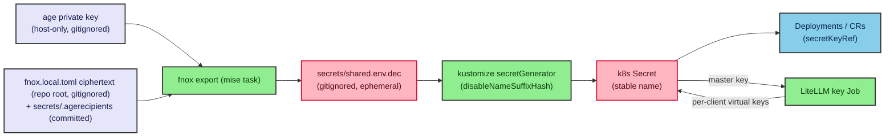

# Secrets, Credentials & Identity

This document describes how the ai-infra-platform lab declares, stores, decrypts,
materializes, consumes, and protects every credential — on the macOS host and inside
the kubeadm Kubernetes cluster. It is the operator-facing companion to `§11` of the
spec; the spec is authoritative where they differ.

> **Organizing principle: the repository is published.** The repo may contain
> ciphertext, recipient public keys, and placeholder examples — but **never** a single
> decrypted secret value, real email, real host name, real key, or real password.

## Model

There are exactly **two tiers** of configuration value:

1. **Non-sensitive environment** — declared in `mise` (`.config/mise/conf.d/`), plain
   text, committed, safe for anyone to read. Names, ports, model aliases, non-secret
   usernames, and the placeholder admin email (`admin@ai-infra-platform.example`).
2. **Sensitive values** — declared in `fnox` and encrypted with `age`. Only the
   `age`-encrypted ciphertext, the recipient public keys, and `*.env.example`
   placeholder templates are committed. Decrypted plaintext exists **only at runtime**,
   only on the operator's machine, in gitignored files deleted after use, and never in
   git history.

There is deliberately **no `.env` file holding secrets**, **no inline plaintext literal
in any kustomization**, and **no committed Kubernetes Secret with a real value**.
Kubernetes Secrets are **generated at runtime** from `fnox`-decrypted material.

- **mise** holds non-sensitive env only (see `.config/mise/conf.d/10-env.toml`).
- **fnox + age** holds all sensitive values: the committed repo-root `fnox.toml` is a
  **marker-only template** (key declarations, no ciphertext); real age ciphertext
  lives in the **gitignored** sibling `fnox.local.toml`, which fnox's hierarchical
  config merge overlays automatically (local wins).
- **k8s Secrets** are generated at runtime by `mise run secrets:sync`.

## Repo layout — committed vs gitignored

| Path | Committed? | Contents |
|---|---|---|
| `fnox.toml` (repo root) | ✅ committed | **marker-only template**: age provider + `<fnox+age-managed>` placeholder per sensitive key (no ciphertext) |
| `fnox.local.toml` (repo root) | ❌ **gitignored** | real age **ciphertext** for every sensitive key; merged over the template by fnox (local wins) |
| `secrets/.agerecipients` | ✅ committed | age/SSH **public** recipient keys (one per line) |
| `secrets/kustomization.yaml` | ✅ committed | `secretGenerator` that builds namespaced Secrets from the runtime `.dec` |
| `secrets/*.env.example` | ✅ committed | placeholder templates of every key **name** (`<fnox+age-managed>` / `CHANGEME-<component>`) |
| `secrets/age/key.txt` | ❌ **gitignored** | the age **secret** key (master decryptor) |
| `secrets/shared.env` | ❌ **gitignored** | your real plaintext values, transient; delete after sealing |
| `secrets/*.dec`, `secrets/shared.env.dec` | ❌ **gitignored** | runtime-decrypted env, produced by sync, deleted under a `trap` |
| rendered Secret YAML, `*.env.runtime` | ❌ **gitignored** | never committed |

### Required root `.gitignore`

The repo ships a root `.gitignore` (§11.6.1) that ignores age secret keys
(`age.txt`, `*age*.key`, `.config/fnox/age.txt`), all decrypted material (`*.dec`,
`secrets/*.dec`, `*.env.runtime`, `.env`, `.env.*`), rendered secret manifests, TLS/key
material (`*.pem`, `*.key`, `*.crt`, `*.kubeconfig`), and agent-local state
(`.claude/settings.local.json`, and the `.local/` tree — including the raw-API-body
capture dir `.local/logs/claude/otel-raw-bodies/`). It **negates** the example
templates so they stay tracked:

```gitignore
.env.*
!.env.example
!secrets/*.env.example
```

Explicitly committed on purpose: repo-root `fnox.toml` (marker-only template),
`.agerecipients` (public keys), `secrets/*.env.example` (placeholders),
`.claude/settings.json` (non-secret config). The ciphertext store `fnox.local.toml`
is deliberately **gitignored** — nothing decryptable is published, even sealed.

## Runtime flow — decrypt → `.dec` → secretGenerator → Secret → `secretKeyRef`

Runtime secret lifecycle:



Step by step (`mise run secrets:sync`, `.config/mise/tasks/secrets/sync.sh`):

1. `fnox export -f env -o secrets/shared.env.dec` decrypts the sensitive set into a
   transient, **gitignored** `.dec` (owner-only; the script logs key names, never
   values).
2. `sync.sh` is the **authoritative materializer**: it loads the `.dec` and creates
   EACH namespaced Secret with the EXACT key names its consumer expects, REMAPPING
   the fnox key to the consumer k8s key where they differ (e.g. fnox `LANGFUSE_SALT`
   → k8s `salt`, `VALKEY_PASSWORD` → `redis-password`, `SEAWEEDFS_S3_ACCESS_KEY` →
   `s3-access-key-id`). It also builds the things a flat `secretGenerator` cannot:
   the CNPG `<cluster>-app` `kubernetes.io/basic-auth` Secrets (`username`+`password`,
   which CNPG adopts and tops with a `uri` key), the SeaweedFS `seaweedfs_s3_config`
   JSON, the cross-namespace S3-cred mirrors (`loki-s3-creds`, `tempo-s3-creds`), and
   the derived OTel `Basic <base64(public:secret)>` header.
3. Each Secret is applied with `kubectl create secret … --dry-run=client -o yaml |
   kubectl apply --server-side -f -` (idempotent create-or-update; stable names).
4. A `trap` removes the `.dec` on exit (success or failure).

`secrets/kustomization.yaml` remains as a **simple structure-preview** path only —
it renders four Secret shells from the `.dec` so the shape can be eyeballed without a
cluster, but its key names are the raw fnox names (un-remapped). It is NOT the
materializer; `sync.sh` is.

### One shared `.dec` for cross-namespace mirroring

A single `secrets/shared.env.dec` is the source for **every** namespaced Secret. The
same decrypted value (e.g. `VALKEY_PASSWORD`, `LANGFUSE_PG_PASSWORD`) is written into
multiple namespaces from one file — eliminating the prior hand-copied "KEEP IN SYNC"
duplication. **Rotating a value = re-seal once in fnox + re-run `secrets:sync`**; every
namespace picks up the new value. The Secrets `sync.sh` materializes are:

| Secret | Namespace | Type | Notes |
|---|---|---|---|
| `langfuse-app-secrets` | `langfuse` | Opaque | all Langfuse app creds (remapped keys) |
| `langfuse-shared-passwords` | `langfuse-data` | Opaque | ClickHouse + Valkey passwords |
| `langfuse-pg-app` | `langfuse-data` | basic-auth | CNPG adopts + adds `uri` |
| `langfuse-seaweedfs-s3-secret` | `langfuse-data` | Opaque | S3 creds + `seaweedfs_s3_config` JSON |
| `litellm-pg-app` | `litellm` | basic-auth | CNPG adopts + adds `uri` |
| `litellm-app-secrets` | `litellm` | Opaque | master key + Langfuse project keys |
| `grafana-pg-app` | `lgtm` | basic-auth | CNPG adopts + adds `uri` |
| `grafana-admin` | `lgtm` | Opaque | `admin-user` / `admin-password` |
| `loki-s3-creds` | `lgtm` | Opaque | SeaweedFS S3 creds (cross-ns mirror) |
| `tempo-s3-creds` | `lgtm` | Opaque | SeaweedFS S3 creds (cross-ns mirror) |
| `langfuse-otel-basic-auth` | `lgtm` | Opaque | derived `Basic base64(public:secret)` |

(The full fnox-key → consumer-k8s-key remap table is in
`planning/claude/opus-4-8-1m/v7/ultracode/implementation/validation/secret-map.md`.)

### `DATABASE_URL` via CNPG-minted `uri`

CloudNativePG mints a per-cluster Secret with both a `password` key and a ready-to-use
`uri` key (full `postgresql://...` string). Applications consume the **CNPG-minted
`uri`** via `secretKeyRef` rather than duplicating the password into a hand-built
`DATABASE_URL` literal:

```yaml
- name: DATABASE_URL
  valueFrom:
    secretKeyRef:
      name: litellm-pg-app   # CNPG-published Secret for the cluster
      key: uri               # full postgresql:// connection string
```

The CNPG `langfuse-pg` / `litellm-pg` clusters are bootstrapped against a
pre-provisioned `<cluster>-app` Secret whose `password` comes from
`LANGFUSE_PG_PASSWORD` / `LITELLM_PG_PASSWORD` (generated by the sync flow). The same
approach applies to Langfuse's Postgres URL.

### LiteLLM virtual keys are Job-minted, not in fnox-at-rest

LiteLLM uses a two-level credential model: one **master key** (admin-only) and a small
set of **per-client virtual keys**. The master key (`LITELLM_MASTER_KEY`, from fnox) is
injected as `general_settings.master_key: os.environ/LITELLM_MASTER_KEY` and gates the
admin endpoints (`/key/*`, `/team/*`, `/user/*`). **No client is ever configured with
the master key for normal traffic.**

The three v1 virtual keys are **minted at runtime by a provisioning Job** (`POST
/key/generate`, master-key auth), not by kustomize or fnox:

| Key alias | Team | Used by |
|---|---|---|
| `claude-code` | `agents` | Claude Code Max client (proxy auth) |
| `codex` | `agents` | Codex client (proxy auth) |
| `smoke-test` | `service` | §15 smoke/validation harness |

The Job writes each plaintext into a `litellm-key-<alias>` Secret in `litellm`; the
same plaintext is mirrored into fnox under the matching name
(`CLAUDE_CODE_LITELLM_VIRTUAL_KEY`, `CODEX_LITELLM_VIRTUAL_KEY`,
`SMOKE_TEST_LITELLM_VIRTUAL_KEY`) so host-side clients (which run outside the cluster)
can read their key via fnox. The Job is **idempotent** (GET-then-PATCH-or-POST); on a
CNPG re-bootstrap it regenerates fresh plaintexts and the operator re-seals them.

## What secrets exist (inventory by role, never real values)

All values below are `<fnox+age-managed>` — described by role only.

| Key | Role | Consumer / namespace |
|---|---|---|
| `LITELLM_MASTER_KEY` | LiteLLM admin/master key (admin-only) | `litellm` |
| `CLAUDE_CODE_LITELLM_VIRTUAL_KEY` | Claude Code client proxy-auth virtual key | host (Claude Code) |
| `CODEX_LITELLM_VIRTUAL_KEY` | Codex client proxy-auth virtual key | host (Codex) |
| `SMOKE_TEST_LITELLM_VIRTUAL_KEY` | smoke-test client virtual key | host (validation) |
| `LITELLM_PG_PASSWORD` | LiteLLM Postgres app password (CNPG `litellm-pg`) | `litellm` |
| `LANGFUSE_PG_PASSWORD` | Langfuse Postgres app password (CNPG `langfuse-pg`) | `langfuse`, `langfuse-data` |
| `GRAFANA_PG_PASSWORD` | Grafana Postgres app password (CNPG `grafana-pg`) | `lgtm` |
| `LANGFUSE_INIT_USER_PASSWORD` / `LANGFUSE_ADMIN_PASSWORD` | Langfuse bootstrap admin login | `langfuse` |
| `LANGFUSE_PUBLIC_KEY` / `LANGFUSE_SECRET_KEY` | Langfuse project API keys (public/secret key pair) | LiteLLM callback, host hooks |
| `LANGFUSE_NEXTAUTH_SECRET` | Langfuse NextAuth session secret | `langfuse` |
| `LANGFUSE_SALT` | Langfuse hashing salt — **write-once, never rotate** | `langfuse` |
| `LANGFUSE_ENCRYPTION_KEY` | Langfuse field-level encryption — **write-once, never rotate** | `langfuse` |
| `CLICKHOUSE_PASSWORD` | ClickHouse `default` user password (analytics store) | `langfuse-data` |
| `VALKEY_PASSWORD` | Valkey (BullMQ queue) password | `langfuse`, `langfuse-data` |
| `SEAWEEDFS_S3_ACCESS_KEY` / `SEAWEEDFS_S3_SECRET_KEY` | SeaweedFS embedded-S3 credentials (shared with Loki/Tempo S3) | `langfuse-data`, LGTM |
| `GRAFANA_ADMIN_PASSWORD` | Grafana admin login password | `lgtm` |

Agent passthrough headers (the client's subscription OAuth `Authorization`) are
**forwarded unchanged and never logged or stored** — they are not part of the fnox set
and never enter telemetry.

## Operator workflow

```bash
# 1) One-time: generate an age key (secret key gitignored), sync the public recipient.
mise run secrets:keygen        # -> secrets/age/key.txt + recipient in .agerecipients
                               #    and the gitignored fnox.local.toml (created if missing)

# 2) Generate real values and seal them into the gitignored fnox.local.toml ciphertext.
mise run secrets:generate   # gitignored shared.env; preserves existing non-placeholder values
mise run secrets:seal       # encrypt -> fnox.local.toml (no values printed; committed template untouched)

# 3) Materialize k8s Secrets at runtime (decrypt -> .dec -> kustomize -> apply -> rm .dec).
mise run secrets:sync

# (debug) Decrypt to an inspectable .dec without applying (key names only logged):
mise run secrets:unseal        # writes secrets/shared.env.dec (gitignored); remove after use
```

Supplying the age identity to fnox at runtime, in order of preference:

1. **macOS Keychain identity** (`identity = { provider = "keychain", value = "age-key" }`
   in `fnox.local.toml`) — the private key never touches a repo-visible file.
2. **`FNOX_AGE_KEY_FILE`** pointing at an age/SSH key file (no password-protected SSH
   keys).
3. **`FNOX_AGE_KEY`** holding the `AGE-SECRET-KEY-...` string (least preferred).

## Hard rules

- **Never commit decrypted material** — no `*.dec`, no real `*.env`,
  no `secrets/age/key.txt`, no rendered Secret YAML. Enforced by `.gitignore` (§11.6)
  and the `fnox scan` + `gitleaks` pre-commit/CI guards.
- **Never log secrets, auth headers, or keys** — scripts log key **names** and counts
  only. No `set -x` over a decrypt step, no `echo "$SECRET"`, no `kubectl get secret -o
  yaml` of a real Secret into a log or committed artifact. The telemetry pipeline never
  logs the forwarded OAuth `Authorization`, the `x-litellm-api-key` header, or any
  sensitive value.
- **Never rotate `LANGFUSE_SALT` / `LANGFUSE_ENCRYPTION_KEY` after first boot** —
  rotating either permanently invalidates stored Langfuse API keys and renders
  encrypted fields undecryptable. Generate once, seal, freeze. The sync wrapper guards
  against overwriting them after first boot.
- **Idempotent apply** — always `kubectl kustomize | kubectl apply -f -` (or
  `--dry-run=client -o yaml | kubectl apply -f -`) so re-runs update rather than fail.
- **Stable names** — `disableNameSuffixHash: true` so controllers reference fixed
  Secret names across namespaces.

## Authoritative-config precedence

The committed `.claude/settings.json` and `./.codex/config.toml` carry **only
non-secret** values (model placeholders, reasoning effort, approval/sandbox policy,
MCP endpoints, and env-var header references). The **secret references** — virtual
keys, base URLs bound to keys, and derived auth headers — live in the generated,
gitignored `.claude/settings.local.json` or process env from mise / Codex launch-time
`--config` overrides. They are produced from the fnox set and never committed. See
§11 and §2.4 of the spec for the full precedence rules.
